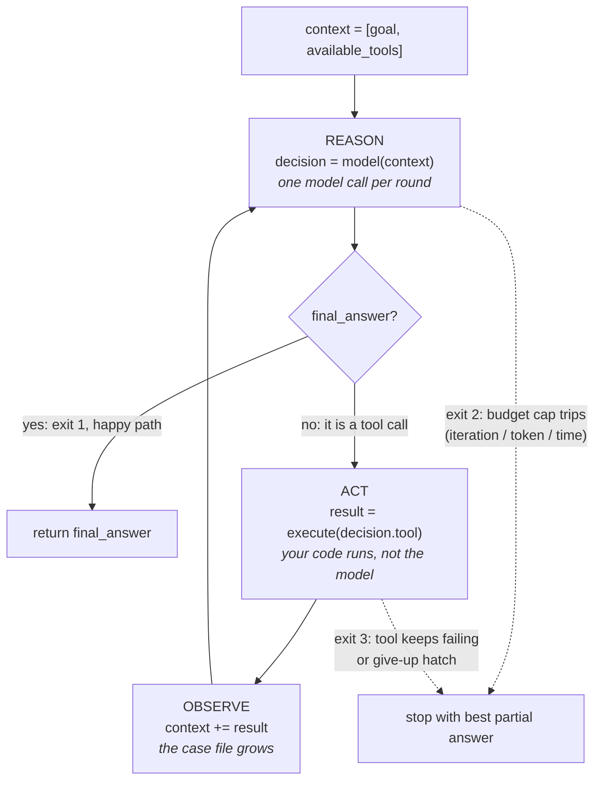

# Agentic AI Basics: Complete Tutorial

> Last updated: 2026-08-28 | Applicable to: AI agent landscape as of mid-2026
> Difficulty: Beginner | Estimated time: 60–90 minutes of reading, plus an optional 30-minute hands-on track

## Tutorial Overview

This tutorial gives you a solid foundation in **agentic AI**: what AI agents are, how they work under the hood, the core design patterns, why they fail, and how the 2026 framework landscape is organized, including LangGraph, the OpenAI/Claude/Google SDKs, CrewAI, Microsoft Agent Framework, Pydantic AI, Spring AI 2.0, and the new autonomous-agent lane (Hermes Agent, OpenClaw).

After completing this tutorial, you will be able to:

- Explain what makes a system "agentic" and distinguish agents from workflows and plain LLM calls
- Describe the reason → act → observe loop and the four building blocks of any agent
- Recognize the core design patterns (ReAct, plan-and-execute, reflection, multi-agent, human-in-the-loop)
- Position any major framework in the landscape and choose one for a given situation
- Build a minimal working agent yourself (optional hands-on track)

**How to read it:** Parts 1–2 are conceptual and sequential: read them in order. Part 3 is hands-on and optional. Part 4 is reference material to revisit later.

---

## Table of Contents

- Part 1: Foundations
  - 1. What is an AI agent?
  - 2. Agent vs. workflow vs. plain LLM call
  - 3. The core agent loop
  - 4. The anatomy of an agent
  - 5. Core design patterns
  - 6. Why agents are hard (the honest part)
  - 7. Context: the agent's case file
  - 8. Tokens and cost estimation
- Part 2: The 2026 Framework Landscape
  - 9. The map: five lanes
  - 10. LangChain + LangGraph
  - 11. The vendor SDKs: OpenAI Agents SDK, Claude Agent SDK, Google ADK
  - 12. CrewAI
  - 13. Microsoft Agent Framework (and the AutoGen legacy warning)
  - 14. The TypeScript camp: Vercel AI SDK + Mastra
  - 15. The minimalist camp: Pydantic AI + smolagents
  - 16. The enterprise application camp: Spring AI 2.0
  - 17. The autonomous-agent lane: Hermes Agent + OpenClaw
  - 18. Honorable mentions
- Part 3: Putting It Into Practice
  - 19. How to choose (decision guide)
  - 20. Optional hands-on track: build a minimal agent
  - 21. Common misconceptions and pitfalls
- Part 4: Reference
  - 22. Advanced topics and learning path
  - 23. Cheatsheet
  - Appendix: Glossary and sources

---

# Part 1: Foundations

## 1. What is an AI agent?

**Objective:** Internalize the one-sentence definition and the four properties that make a system agentic.

An **AI agent** is a system where an AI model (usually an LLM) autonomously pursues a goal by **reasoning, deciding, and acting in a loop**, rather than just answering once.

The one-sentence mental model:

> A chatbot *responds*; an agent *gets things done*: it decides what to do next, uses tools, checks the results, and keeps going until the task is complete.

Four properties make something "agentic":

| Property | Meaning |
|---|---|
| **Autonomy** | Chooses its own next steps instead of following a fixed script |
| **Goal-directedness** | Works toward an outcome, not just a reply |
| **Action** | Can affect the world: search, run code, call APIs, write files |
| **Iteration** | Observes results and adapts its next step accordingly |

**Self-check:** A weather chatbot that answers "What is the capital of France?": is it an agent? (No: one prompt, one answer, no tools, no loop.) A system that researches a company across five websites, compiles a table, and emails it to you: is it? (Yes.)

---

## 2. Agent vs. workflow vs. plain LLM call

**Objective:** Learn the single most important distinction in the field, popularized by Anthropic's "Building Effective Agents" (Dec 2024).

| | Plain LLM call | Workflow | Agent |
|---|---|---|---|
| **Control flow** | One prompt → one answer | Fixed path written by the developer | The model decides dynamically |
| **Tools** | None | Predefined, called in fixed order | Chosen at runtime |
| **Example** | "Translate this text" | Extract → summarize → email (hardcoded chain) | "Research this company and write a report": the agent figures out how |

### Real use cases per level

**Plain LLM call: appropriate when the whole job is one judgment, one transformation.**

1. *Translate a support ticket into English.* One input, one output, nothing to decide. An agent would add cost and failure modes with zero benefit.
2. *Summarize a meeting transcript.* The task never changes shape; only the text does. One call, human reads the result.
3. *Classify the sentiment of a product review* (positive / negative / neutral). The model's entire job is one label; your code does everything before and after.

**Workflow: appropriate when the path is known in advance and only the data changes.**

1. *Invoice processing:* an LLM extracts the totals, the same validation code runs every time, the result is saved to the database. Every step is knowable before the first invoice arrives.
2. *Nightly metrics report:* fetch numbers, summarize them with an LLM, email the result. The steps are fixed; tonight's data is the only variable.
3. *Content moderation pipeline:* an LLM flags suspicious text, fixed rules decide escalation, everything is logged. Auditability is the requirement, and a fixed path is auditable by construction.

**Agent: appropriate only when the next step genuinely depends on results you cannot foresee.**

1. *"Research this company and write a report."* You cannot know in advance how many searches are needed, which sites matter, or when there is enough material.
2. *A coding assistant that edits files, runs the tests, and fixes the failures.* The right next step depends entirely on what the previous step returned.
3. *An IT troubleshooting copilot.* Each diagnostic check determines which check makes sense next; the decision tree is too large and too fluid to hardcode.

### The same problem at all three levels: intent recognition

Intent recognition is the perfect illustration because it *can* be built at any level, and the right choice depends on a few concrete factors. Take the Admin Office chat ("show bookings for unit A12" → call the right function):

- **As a plain LLM call:** five known intents, one call returning a validated intent label, your code dispatches. Cheap, deterministic, one call per turn. For a fixed, small intent set this is *more than enough*; anything fancier buys nothing.
- **As a workflow:** classify → dispatch → format as a hardcoded three-step chain. Same outcome, more explicit structure, still fully predictable. Reasonable if you want the steps logged and tested independently.
- **As an agent:** only worth it when requests can *combine* actions or the paths cannot be enumerated ("add a yoga room, then show this week's bookings and tell me which unit booked the most"). You pay two or more calls per turn and give up deterministic replies in exchange for flexibility you actually need.

**The deciding factors, in order:** how many paths exist (one or a few → LLM call or workflow; unbounded → agent), how much determinism you need (high → avoid the agent), your cost and latency budget (every agent iteration is another paid model call), and how much auditability you need (workflow steps are inspectable; agent steps emerge at runtime).

**The industry rule of thumb:** use the simplest thing that works. Most real production systems are *workflows with a few agentic steps*, not fully autonomous agents. Full autonomy is expensive, slow, and hard to make reliable. You pay for it only where the path genuinely cannot be predicted in advance.

**Self-check:** Your app extracts invoice totals with an LLM, then always runs the same validation code, then saves to a database. Agent or workflow? (Workflow: the path is fixed.)

---

## 3. The core agent loop

**Objective:** Understand the heart of every agent system ever built.

Before any framework, any pattern, any SDK, understand this: **an agent is just a loop.** You hand the model a goal and a menu of tools. Each round, the model reads everything that has happened so far and makes exactly one decision: either "I have the answer, here it is" or "run this tool with these inputs." Your code runs the tool, appends the result to the record, and asks again. That is the entire mechanism. Frameworks add reliability, state management, and ergonomics around it, but they never replace it.

**A real-life picture: the detective and the case file.** A detective works a case in rounds. Every morning she reads the *entire* case file from page one (she keeps nothing in her head), then decides the single next move: interview a witness, request a phone record, or close the case. The interview transcript gets stapled into the file, and tomorrow she reads the bigger file again. Three things to notice, because each maps to a part of the loop:

- **The case file is everything.** The detective's "memory" is not in her head; it is the accumulated file she re-reads each round. In an agent, that file is called the *context*.
- **The detective never does the lab work herself.** She *requests* it; someone else runs it and hands back a report. Likewise, the model never executes a tool; it emits a request, and your code executes it.
- **The case ends in one of three ways:** she solves it, the budget runs out, or she is pulled off the case. Agents need the same three exits, or they loop forever.

Every agent, from a 20-line script to Hermes Agent, runs some version of this loop:

```python
context = [goal, available_tools]

while not done:
    decision = model(context)        # REASON: what should I do next?
    if decision is a final_answer:
        break
    result = execute(decision.tool)  # ACT: run the tool
    context += result                # OBSERVE: feed the result back in

return final_answer
```

The same loop as a flow chart, with each node labelled by the pseudocode line it runs:



Three things to read off the chart:

- **The cycle B → C → E → F → B is the whole agent.** Everything a framework adds hangs off these four nodes; nothing replaces them.
- **Only node B talks to the model.** Nodes E and F are ordinary code: validation, execution, bookkeeping. That is where your guardrails live.
- **The dotted exits are not optional.** An agent drawn without the budget cap and the give-up hatch is an agent that will one day loop until the bill arrives.

### Reading the loop, line by line

**REASON: one model call per iteration.** The model sees the goal, the tool menu, and the full history, and produces one of only two things: a tool call (name + arguments) or a final answer. There is no third option. This is why "the model decides" and "the model acts" are different statements: deciding is all it ever does.

**ACT: your code, not the model.** The framework validates the tool request (does this tool exist? do the arguments fit the schema?), runs your function, and captures the return value. This boundary matters twice over: it is why tools must return serializable data, and it is your security checkpoint, the place where least-privilege rules and approval gates live.

**OBSERVE: append and repeat.** The tool result is added to the context, which therefore grows every round. Two consequences: the context *is* the agent's short-term memory (this answers the self-check below before you read it), and loops fill the context window fast, which is why long tasks lose the original goal.

### A full trace, end to end

Goal: "Is it warm in Cairo right now?", with one tool `current_temperature(city)` available.

| Round | Model sees | Model decides | Code does |
|---|---|---|---|
| 1 | Goal + tool menu | Tool call: `current_temperature("Cairo")` | Runs the tool, gets "27°C", appends it |
| 2 | Goal + menu + "27°C" | Final answer: "Yes, 27°C, quite warm." | Loop exits |

Two model calls, one tool call, done. Notice round 2 costs more than round 1: the model re-reads everything, including the tool result. A turn where the model needs no tools exits after round 1 with a direct answer; that is the cheapest possible agent run.

### The three exits (never ship without them)

1. **Final answer:** the model declares the goal met. The happy path.
2. **Budget exhausted:** an iteration cap, token cap, or time cap trips. This is not a failure mode; it is a safety feature, and every production agent has one.
3. **Error or give-up:** a tool keeps failing, or the model uses an explicit "I cannot do this, here is why" escape hatch you gave it. Better a clean apology than an infinite loop.

If you truly internalize **reason → act → observe → repeat**, you understand roughly 80% of agent systems. Everything else in this tutorial (frameworks, patterns, protocols) is engineering built around this loop.

**Self-check:** In the loop above, where does "memory" live? (In `context`: the accumulated history the model sees each iteration.)

---

## 4. The anatomy of an agent

**Objective:** Name the four building blocks and the role of each.

**1. The model (the brain).** Does the reasoning and decision-making. Capabilities that matter: instruction following, planning, and *tool calling*: emitting structured requests like "call function X with these arguments."

**2. Tools (the hands).** Anything the agent can invoke: web search, calculators, code execution, databases, file systems, APIs. A tool = a name + a description + an input schema. Tool descriptions matter enormously: they are how the model knows *when* and *how* to use a tool. The emerging standard for connecting tools is **MCP (Model Context Protocol)**.

**3. Memory.**

- *Short-term:* the context window, the running transcript of the current task
- *Long-term:* vector databases, files, or knowledge bases the agent can store to and retrieve from across sessions

**4. Planning and orchestration (the scaffolding).** The code that runs the loop: managing state, decomposing big goals into subtasks, handling errors, enforcing budgets and guardrails, deciding when to stop.

### Details

Think of building an agent like staffing a small office. You need someone who thinks (the brain), equipment they can use (the hands), somewhere to keep notes (memory), and an office manager who keeps the whole operation on track (the scaffolding). Each block below answers one question: what it is, why it matters, and what trips beginners up.

#### The model, in detail

The model is the *only* part of the agent that thinks. Everything else is ordinary code. Remember from Section 3: per round, the model's entire output is one of two things — "call tool X with these arguments" or "here is the final answer." It never clicks a button, opens a file, or sends an email. It *decides*; your code *does*.

Three practical things to know as a beginner:

- **Not every model can be an agent brain.** Tool calling is a trained-in skill: the model must reliably emit structured requests (a tool name plus arguments in the right format) instead of rambling prose. All the major frontier models can do this; many smaller or older models cannot. This is the first checkbox when picking a model for an agent.
- **Bigger is not always better.** Each round of the loop is a paid model call, and a 10-round task is 10 calls. A mid-tier model that follows instructions well often beats a flagship model on cost and speed for routine agent work.
- **The model forgets everything between calls.** It has no memory of its own. Whatever it needs to know must be in the context you hand it each round — which is exactly why the next two blocks exist.

#### Tools, in detail

A tool is just a function your code owns, described to the model in a format it can understand. The description is not documentation for humans — it *is* the model's instruction manual, and it is often the difference between an agent that works and one that flails. Compare:

```python
# Bad: the model has to guess what this is for
def query(q: str) -> str: ...

# Good: the model knows what it does, when to use it, and what it returns
def search_bookings(unit_id: str) -> list[dict]:
    """Look up all bookings for a housing unit.

    Use this when the user asks about reservations, schedules, or
    availability of a specific unit (e.g., "A12"). Returns a list of
    bookings with date, time, and resident name.
    """
```

A few rules of thumb:

- **Give fewer, sharper tools rather than many vague ones.** With 5 well-described tools the model rarely misfires; with 50 overlapping ones it picks wrong constantly. (Section 21, Pitfall 5, covers the fix when you genuinely have hundreds.)
- **Tools are your security perimeter.** The model can be tricked by malicious content it reads (prompt injection, Section 6), so each tool should have the *least* power needed: a read-only database tool, not a full-access one; a "draft email" tool, not a "send email without asking" one.
- **MCP is worth one sentence now, depth later.** The Model Context Protocol is a shared plug standard: instead of writing custom glue for every tool, tools exposed over MCP work with any MCP-compatible framework. Think "USB-C for agent tools." It is why tools are becoming portable across the frameworks in Part 2.

#### Memory, in detail

The two kinds of memory map to a desk and a filing cabinet:

- **Short-term memory is the desk: the context window.** Everything on it is visible to the model right now: the goal, the tool menu, every tool result so far. It is fast and effortless, but two traps come with it. First, the desk has a fixed size — long tasks fill it, and the model starts "forgetting" the original goal simply because it scrolled out of view. Second, everything on the desk is re-read (and re-billed) every single round.
- **Long-term memory is the filing cabinet: external storage the agent queries via tools.** A vector database for semantic search ("find notes similar to this"), plain files, or a knowledge base. Unlike the desk, the cabinet survives across sessions: a personal agent that "remembers you" is really just an agent with a well-organized filing cabinet. Hermes Agent's skill library (Section 17) is the current reference design for this.

The beginner mistake is treating the context window as the only memory and stuffing everything into it. The practical pattern: keep the desk for the current task, file durable facts in the cabinet, and give the agent a tool to search the cabinet when it needs them.

#### Planning and orchestration, in detail

This is the least glamorous block and the one that decides whether your agent survives contact with reality. It is plain code — no AI in it — and it handles everything the model cannot be trusted with:

- **Running the loop itself**: passing context to the model, validating its tool requests, executing tools, appending results.
- **Budgets and exits**: the iteration caps, token limits, and give-up hatches from Section 3. Without these, the other three blocks are an unbounded bill waiting to happen.
- **Error handling**: a tool times out, returns garbage, or the model emits a malformed request — the scaffolding catches it, feeds a useful error back into the context, and lets the loop continue instead of crashing.
- **Guardrails**: approval gates, least-privilege checks, and "never do X without asking" rules, enforced in code where the model cannot talk its way around them.

This is also where frameworks earn their keep. The four blocks are all you *conceptually* need; LangGraph, the vendor SDKs, and friends are mostly polished, battle-tested scaffolding so you do not hand-roll state management and error recovery.

#### The anatomy at a glance

| Block | Office analogy | What it really is | Classic beginner mistake |
|---|---|---|---|
| Model | The thinker | An LLM that only ever *decides* | Expecting it to execute things or remember past rounds |
| Tools | The equipment | Your functions + descriptions the model reads | Vague descriptions; too much power per tool |
| Memory | Desk + filing cabinet | Context window + external stores | Stuffing everything into the context window |
| Orchestration | The office manager | Plain code: loop, budgets, errors, guardrails | Skipping budgets and exits because "the demo worked" |

**Self-check:** Which block decides *which* tool to call: the tools or the model? (The model; the tools just exist with descriptions.)

---

## 5. Core design patterns

**Objective:** Recognize the five patterns that appear in almost every agent system.

- **ReAct (Reason + Act)**: the classic: the model writes a "thought," then takes an action, then reads the observation. Thought → action → observation, interleaved.
- **Plan-and-Execute**: a planner first produces a multi-step plan; an executor carries out the steps; the system replans when reality deviates.
- **Reflection / self-critique**: the agent evaluates its own output and retries ("Is this code correct? Run it and check").
- **Multi-agent**: specialized agents coordinated together: an orchestrator delegates to workers (researcher, coder, critic…). Powerful, but adds real complexity.
- **Human-in-the-loop**: the agent pauses for approval at high-stakes steps. Essential in production.

### Details

These patterns are not competing products — they are reusable answers to recurring problems, and real systems combine them. A coding assistant might plan-and-execute the overall task, use ReAct inside each step, reflect on failing tests, and pause for human approval before merging. Below: what each one looks like in practice, why it works, and when to reach for it.

#### ReAct, in detail: thinking out loud

ReAct is the loop from Section 3 with one tweak: the model is asked to *write down its reasoning* before each action. A raw trace looks like this:

```text
Thought: I need the release date of Framework X. I should search the web.
Action: web_search("Framework X release date")
Observation: "Framework X 2.0 was released on June 12, 2026."
Thought: I have the answer.
Final answer: June 12, 2026.
```

Why bother making the model narrate? Two reasons. First, writing the "thought" forces the model to commit to a plan before acting, which measurably reduces impulsive, wrong tool calls — the same way you think more clearly when you explain your reasoning to a colleague. Second, the transcript becomes readable by humans: when the agent goes wrong, you can see *where* its reasoning went off the rails instead of staring at a mysterious sequence of tool calls.

**Use it when:** almost always — it is the default behavior baked into most frameworks. **Cost:** longer outputs per round, so slightly more tokens per iteration.

#### Plan-and-Execute, in detail: the project manager and the worker

ReAct decides one step at a time, which works well for short tasks but can wander on long ones — like driving cross-country by choosing each turn at each intersection. Plan-and-Execute separates the job into two roles:

1. **The planner** (often a strong model) looks at the goal once and produces the whole route: "1. Find the company's financials. 2. Find recent news. 3. Identify competitors. 4. Write the report."
2. **The executor** (often a cheaper model, or simple ReAct loops) carries out the steps one by one.
3. **Replanning**: when step 2 turns up something unexpected — say, the company was just acquired — the system goes back to the planner: "the situation changed, revise the remaining plan."

The win: the expensive "big picture" reasoning happens rarely instead of every round, and the agent is far less likely to lose track of the goal halfway through. The cost: more machinery to build, and a bad initial plan can send the executor confidently down the wrong path until a replan catches it.

**Use it when:** tasks with many steps (roughly 5+) where the overall shape is knowable up front, like research reports or multi-file code changes.

#### Reflection, in detail: the agent as its own reviewer

The pattern: after producing an output, the agent is asked to *grade its own work* and improve it — one extra pass of "what is wrong with this?" before declaring done.

```text
Draft: [agent writes code to parse a CSV file]
Critique: "This crashes on empty lines and assumes a header row. Fix both."
Revised draft: [agent writes the corrected code]
Verify: run the tests → all pass → done.
```

Reflection works best when there is a *real checker* in the loop, not just the model's opinion. "Does the code pass its tests?" is a ground truth the agent can verify with a tool; "is this essay good?" is the model grading its own homework, which helps less. This is why reflection is a superstar in coding agents (compilers and test suites are free, honest critics) and merely decent for open-ended writing.

**Use it when:** a cheap, objective check exists — tests, linters, schema validators, database constraints. **Cost:** each reflection round is more model calls, so cap the retries (two or three rounds, not ten) or you trade quality problems for cost problems.

#### Multi-agent, in detail: a team instead of a person

Instead of one agent doing everything with one giant context, you run several specialized agents and coordinate them. The most common arrangement is **orchestrator + workers**: a lead agent breaks the goal into subtasks, hands each to a specialist (researcher, coder, critic), collects the results, and assembles the final answer.

Two honest benefits:

- **Focused contexts.** Each worker sees only its own subtask and tools, so no single context window gets stuffed with everything. The researcher never has to scroll past the coder's test output.
- **Focused prompts.** A specialist with a sharp system prompt ("you are a security reviewer; find vulnerabilities, ignore style") often outperforms a generalist asked to wear five hats at once.

And two honest costs, which is why Section 6 warns about this pattern:

- **Coordination overhead.** Agents communicate through model calls, and multi-agent "chatter" burns tokens fast — the CrewAI verdict from Section 12 ("crews for prototypes, Flows for anything real") is exactly this lesson.
- **New failure modes.** Errors now *compound across agents*: a confused researcher hands bad facts to a diligent writer, who polishes them into a confident, wrong report.

**Use it when:** subtasks are genuinely independent and each needs its own large context or toolset. **Avoid when:** one agent with a good prompt and tools could do it — start there; promote to multi-agent only when a single context or prompt becomes the bottleneck.

#### Human-in-the-loop, in detail: the approval stamp

The simplest pattern and, in production, the least optional one. The agent runs normally until it reaches a high-stakes step, then *pauses and waits for a human decision* before proceeding:

```text
Agent: "I have drafted this email to all 5,000 customers. Send it? [yes / no / edit]"
Human: [reviews, clicks yes]
Agent: [sends, continues]
```

The design rule is about **reversibility**. Reading a web page, drafting a document, running a query — reversible, let the agent proceed. Sending money, deleting data, publishing content, emailing customers — irreversible, gate it behind a human. Good systems make this a property of the *tool*, not a hope about the model's judgment: the "send" tool simply requires an approval token that only the human checkpoint can issue, enforced in the orchestration code from Section 4.

The human does not have to approve *everything* — that would defeat the purpose of an agent. The craft is choosing the few steps where a mistake is expensive and irreversible, and gating exactly those.

**Use it when:** anything that touches money, production systems, external communication, or user data. Which is to say: nearly every real deployment.

#### Choosing a pattern at a glance

| Pattern | One-line idea | Reach for it when… | Watch out for… |
|---|---|---|---|
| ReAct | Think out loud, then act | Default; nearly always | Slightly higher token use per round |
| Plan-and-Execute | Plan the route, then drive it | Long tasks with a knowable shape | Bad initial plans; replanning complexity |
| Reflection | Grade your own work, retry | An objective checker exists (tests, validators) | Retry loops without a cap |
| Multi-agent | Specialists coordinated by a lead | Independent subtasks, big separate contexts | Token-heavy chatter; errors compounding across agents |
| Human-in-the-loop | Pause for approval at risky steps | Irreversible or expensive actions | Gating everything (agent becomes pointless) or nothing |

### Real use cases

The patterns are easier to recognize in tools you may already use. Three real systems, three different mixtures of the five patterns — and one of them turns out not to be an agent at all, which is the most instructive part.

#### Claude Code: the interactive craftsman

**What it is:** Anthropic's terminal-based coding agent. You give it a task ("add pagination to the bookings endpoint"), and it explores your codebase, edits files, and runs commands until the job is done. It is also the harness behind the Claude Agent SDK from Section 11.2.

**How it uses the patterns — all five:**

- **ReAct** is its heartbeat: every step is reason → call a tool (read a file, edit, run bash) → read the result → repeat.
- **Plan-and-Execute** shows up as *Plan Mode*: for non-trivial tasks it explores the codebase read-only, presents a written plan, and only starts editing after you approve it — a planner phase and an executor phase with a human gate in between.
- **Reflection** happens every time it runs the test suite or build, reads a failure, and revises its own code. The compiler is the objective checker that makes this reflection reliable.
- **Multi-agent** via subagents: for wide searches or parallel investigations it can spawn child agents with their own isolated contexts, keeping its main context window clean — exactly the "focused contexts" benefit from the Details section.
- **Human-in-the-loop** via its permission system: read-only actions flow freely, but running an unfamiliar command or editing outside the expected scope pauses for your approval. Risky = gated, safe = automatic.

#### GitHub Spec Kit: the one that is not an agent

**What it is:** an open-source toolkit from GitHub for **spec-driven development** — the idea that the specification, not the code, is the primary artifact, and code is a generated expression of it. Concretely, Spec Kit is the `specify` CLI plus a set of templates and slash commands (`/speckit.specify`, `/speckit.plan`, `/speckit.tasks`, `/speckit.implement`, and supporting ones like `/speckit.constitution`, `/speckit.clarify`, `/speckit.analyze`) that get installed into your repo and drive *whichever coding agent you already use* — Claude Code, GitHub Copilot, Codex CLI, Gemini CLI, and others.

**How it works:** you move through a fixed sequence of phases, and each phase produces a markdown artifact that feeds the next:

1. `/speckit.specify` — describe *what* you want and *why*; the agent writes `spec.md`.
2. `/speckit.clarify` — the agent interviews you to resolve ambiguities in the spec.
3. `/speckit.plan` — you add the *how* (stack, constraints); the agent writes the technical design in `plan.md`.
4. `/speckit.tasks` — the plan is broken into an ordered, executable task list (`tasks.md`).
5. `/speckit.analyze` — a consistency check across all three artifacts before any code exists.
6. `/speckit.implement` — the agent finally writes code, task by task.

**Is it an AI agent? No — and that is the lesson.** Spec Kit has no model, no tools, no loop of its own. Run through the Section 1 checklist: no autonomy (the phases follow a fixed script), no tools it invokes itself, no iteration it controls. What it *is*: a **workflow** in the precise Section 2 sense — a fixed, developer-designed path (specify → clarify → plan → tasks → analyze → implement) whose individual steps are executed by a real agent underneath. When you run `/speckit.implement`, it is Claude Code or Codex doing ReAct loops, editing files, and running tests; Spec Kit just hands it the right task with the right context, in the right order. It is the clearest real-world example of this tutorial's core rule: *most production-grade systems are workflows with agentic steps, not fully autonomous agents.*

**How it uses the patterns — from the outside in:**

- **Plan-and-Execute at the macro level:** the whole pipeline is the planner/executor split made literal — `plan.md` + `tasks.md` are the multi-step plan, `/speckit.implement` is the executor, and you replan by revising the spec.
- **Human-in-the-loop as the connective tissue:** nothing flows from one phase to the next automatically. You review and edit the spec before planning, the plan before tasks, the tasks before implementation. The gates are the product.
- **Reflection via `/speckit.analyze`:** an explicit critique pass that cross-checks spec, plan, and tasks for contradictions *before* code is written — reflection moved earlier, where mistakes are still cheap.
- **What it deliberately avoids:** autonomous loops. No phase runs without you invoking it. Spec Kit bets that structure and human checkpoints beat autonomy for building real software — the Section 6 philosophy, productized.

#### OpenAI Codex: the autonomous teammate you review after the fact

**What it is:** OpenAI's coding agent. In its cloud form, you assign a task ("fix the timezone bug in the scheduler"), and Codex works *unattended* in a sandboxed environment with a copy of your repo — reading code, making changes, running tests — then hands you a finished pull request. (There is also a Codex CLI for interactive terminal use, similar in shape to Claude Code.)

**How it uses the patterns — the same five, rebalanced for autonomy:**

- **ReAct** drives the sandbox session: read, edit, run, observe, repeat — with no human watching.
- **Reflection** is doing the heaviest lifting here: because nobody is there to catch mistakes, Codex leans on running the test suite and iterating until green. It is the strongest example of the Details-section point that reflection shines when an objective checker exists.
- **Plan-and-Execute** happens internally: the task is decomposed into subtasks, worked through, and adjusted when reality deviates from the plan.
- **Human-in-the-loop — moved, not removed.** This is the instructive contrast with Claude Code: instead of gating each risky action mid-task (impossible when the agent runs unattended), the approval gate moves to the *deliverable*. The sandbox prevents damage during the work; the PR review gates the irreversible step — merging. Same pattern, different placement, chosen to fit the operating mode.

**The takeaway across the three:** the patterns are a toolkit, not a checklist. Claude Code uses all five interactively; Codex uses the same five but shifts the human gate to the end because it works unattended; Spec Kit shows you can get most of the value of plan-and-execute, reflection, and human-in-the-loop *without building an agent at all* — by wrapping a fixed workflow around one.

| Use case | ReAct | Plan-and-Execute | Reflection | Multi-agent | Human-in-the-loop |
|---|---|---|---|---|---|
| Claude Code | Core loop | Plan Mode | Test-driven fixes | Subagents | Permission prompts mid-task |
| Spec Kit (not an agent) | Delegated to the underlying agent | The whole pipeline | `/speckit.analyze` | Avoided | Gates between every phase |
| OpenAI Codex | Sandbox loop | Internal task breakdown | Test iteration, unattended | Limited | PR review at the end |

**Self-check:** An agent that writes a plan of 6 steps, executes them one by one, and revises the plan after a failure is using which pattern(s)? (Plan-and-execute, with reflection during replanning.)

---

## 6. Why agents are hard (the honest part)

**Objective:** Understand the engineering realities before trusting any demo.

- **Error compounding.** If each step is 95% reliable, a 20-step task fully succeeds only about 36% of the time (0.95^20 ≈ 0.36). Step count is the enemy of reliability. Keep agents on short leashes and prefer workflows where possible.
- **Context limits.** Loops fill the context window fast; agents lose track of the original goal (the full treatment: Section 7).
- **Evaluation is genuinely hard.** How do you grade "did the agent research this well"? Tracing and observability tools are a whole subfield for this reason.
- **Security.** Agents that act on the world can be tricked (prompt injection). Give them least-privilege tool access, sandboxes, and approval gates for irreversible actions.
- **Cost and latency.** Every loop iteration is another model call; autonomous multi-agent "chatter" burns tokens fast (forecast it with Section 8).

The practical craft of agent engineering is mostly about *constraining* autonomy so the agent stays reliable.

---

## 7. Context: the agent's case file

**Objective:** Understand what "context" actually is, what a context window is, why window sizes differ so much between models, and what it would take to build a 2-million-token agent.

In Section 3 the detective re-read the *entire case file* every morning. That file has a technical name: the **context**. It is the complete bundle of text the model receives on every call, and it is the model's whole world: anything not in the context does not exist for the model.

Concretely, the context of a typical agent call contains five things:

| # | Context ingredient | Example |
|---|---|---|
| 1 | System prompt | "You are an IELTS essay-grading assistant. Be honest, be specific…" |
| 2 | Tool menu | Names, descriptions, and input schemas of every available tool |
| 3 | Conversation / task history | The user's goal and every message so far |
| 4 | Tool results | Everything the OBSERVE step appended (Section 3) |
| 5 | The model's own previous outputs | Its earlier reasoning, tool calls, and partial answers |

Two properties follow immediately, both foreshadowed earlier:

- **The model has no memory of its own** (Section 4). Between calls it forgets everything; the context *is* its memory.
- **The context grows every round of the loop** (Section 3), because each tool result is appended. This is why agents burn through their context budget far faster than chatbots do.

### The context window: the desk has a fixed size

The **context window** is the maximum amount of text — measured in *tokens* (Section 8) — that a model can consider in a single call. It is a hard physical limit of the model, not a billing setting: exceed it and the request fails (or, in some products, the oldest content is silently dropped).

One detail beginners miss: **the window covers input *and* output together.** A 200K-token window filled with 190K tokens of case file leaves only 10K tokens for the model's reply.

Why does the window matter so much for agents specifically? Because the loop re-reads the whole file every round. A chatbot user feels the limit only after a very long conversation; an agent hits it *by design*, on every long task. Section 6's "agents lose track of the original goal" is exactly what a full window looks like from the outside.

### Why do window sizes differ so much between models?

As of mid-2026, advertised windows span almost two orders of magnitude:

| Model (mid-2026) | Context window | Notes |
|---|---|---|
| Claude Opus 4.6 / Sonnet 4.6 (Anthropic) | 200K standard; **1M** on the long-context tier | 1M reached general availability in March 2026, billed at a premium |
| Kimi K3 (Moonshot AI) | **1M** | 2.8T-parameter MoE model built explicitly for long-horizon work; the earlier K2 line sat at 256K |
| GPT-5 family (OpenAI) | 400K; ~1M on the newest flagship tier | Max output is a separate, smaller cap (e.g., 128K) |
| Gemini (Google) | 1M, with 2M on some tiers | The pioneer of million-token windows |
| Smaller / older open-weight models | 32K–256K | Fine for short tasks; tight for agents |

How did Anthropic and Moonshot get to 1M when 200K used to be the frontier norm? Not one trick — a stack of them:

1. **Attention is the bottleneck.** In a vanilla transformer every token attends to every other token, so compute grows with the *square* of the context length: double the window, quadruple the cost. And while generating, the model keeps a per-token "KV cache" in GPU memory; at 1M tokens that cache alone is tens of gigabytes per request.
2. **Cheaper attention patterns.** Long-context models replace full attention with efficient variants — sparse attention (each token attends only to selected others), sliding-window attention (attend locally, pass information forward layer by layer), or hybrid designs like the Delta-Attention-style layers in the Kimi lineage. A little theoretical precision is traded for enormous savings.
3. **Compressed memory.** Multi-head Latent Attention (MLA, popularized by DeepSeek and used across the Kimi family) shrinks the KV cache by storing a compressed representation instead of every token's full keys and values.
4. **Position-encoding stretching.** Models learn *where* a token sits via position encodings (RoPE); scaling techniques such as position interpolation and YaRN let a model trained on shorter contexts operate reliably at much longer ones.
5. **Training on long data, and paying to serve it.** A 1M-token request costs the provider far more to serve, which is why Anthropic bills long-context usage as a premium tier. A big window is as much an *infrastructure and pricing decision* as a research result.

One honest caveat: **advertised ≠ effective.** Models recall and reason worse over content buried in the middle of a huge context (the "lost in the middle" effect). A vendor ships the window that survives its benchmarks; your agent experiences something smaller.

### "I want a 2-million-token agent" — in theory, how?

There are two very different answers, and you should know both.

**Answer 1 (the research-lab answer): make the window itself bigger.** Take the five techniques above and push them further: sparser or near-linear attention so cost grows almost linearly instead of quadratically, more aggressive KV-cache compression, position-encoding extrapolation, training runs on 2M-token documents, and serving setups that shard the attention computation across many GPUs ("ring attention"). This is genuinely how million-token models came to exist — Google already ships 2M on some Gemini tiers. But it is capital-intensive model research, not something you bolt onto an existing product.

**Answer 2 (the engineer's answer, and almost always the right one): you don't need a 2M window — you need context engineering.** Production agents simulate an effectively unlimited context on top of an ordinary window:

- **Compaction:** when the context approaches the limit, the agent summarizes the older portion into a dense note and keeps going (Claude Code does exactly this with auto-compact). The case file becomes "summary of chapters 1–9, plus the full text of chapter 10."
- **External memory:** durable facts go to the filing cabinet — files, a vector database, a skill library (Section 4; Hermes Agent in Section 17 is the reference design) — and the agent pulls them back through search tools only when relevant.
- **Subagents:** self-contained subtasks are delegated to child agents with fresh, isolated windows; only their *conclusions* return to the main context (the multi-agent pattern, Section 5).
- **Discipline:** truncate tool outputs, cap file reads, and never paste an entire repository into the context when a search would do.

The mental model: **the context window is RAM; context engineering is virtual memory.** Nobody buys 2M tokens of RAM when a good paging system does the same job at a fraction of the cost — and Section 8 shows you the bill that proves it.

**Self-check:** Your agent's window is 200K tokens and the context already holds 195K. The model replies with a truncated two-line answer and stops. Why? (The window is shared: only ~5K tokens remained for the output.)

---

## 8. Tokens and cost estimation

**Objective:** Know what a token actually is, estimate input and output tokens *before* running anything, and produce a defensible cost forecast for an agent product — worked end-to-end on an essay-grading agent.

### What a token is

Models do not read characters or words; they read **tokens**: chunks of text drawn from a fixed vocabulary, produced by a tokenizer. Rough conversions for English:

- 1 token ≈ 4 characters ≈ ¾ of a word
- 100 tokens ≈ 75 words ≈ a solid paragraph
- 1 page of text ≈ 500–700 tokens; a 250-word IELTS essay ≈ 350–450 tokens

```text
"unbelievable"   → ["un", "believ", "able"]        3 tokens
"Hello, world!"  → ["Hello", ",", " world", "!"]   4 tokens
```

Two practical warnings. First, **not all text tokenizes equally:** code, JSON, numbers, and non-English languages cost more tokens per character — Arabic text can take 2–4× the tokens of the same meaning in English. Second, **each model family has its own tokenizer**, so counts differ slightly between providers. For real numbers, use the provider's tokenizer tool (e.g., `tiktoken` for OpenAI models) or the `usage` field that every API response returns.

### Input tokens vs. output tokens

Every API call is billed in two directions, at different prices:

| | Input (in-tokens) | Output (out-tokens) |
|---|---|---|
| What it is | Everything you *send*: system prompt, tool schemas, history, tool results | Everything the model *generates*: the reply, tool calls, and (for reasoning models) hidden "thinking" tokens |
| Typical price ratio | 1× | 3–6× the input price |
| Why the difference | Reading is parallel across GPUs | Generation is serial: one token at a time, each needing a full model pass |

### Why agents multiply tokens

Here is the arithmetic that surprises everyone: **every round of the agent loop re-sends the entire context** (Section 7). A 3-round agent does not cost 3× a single call — it costs more, because each call is bigger than the last:

| Round | Context sent (input) | Model emits (output) |
|---|---|---|
| 1 | 3,000 (system prompt + tools + goal) | 150 (a tool call) |
| 2 | 3,300 (+ tool result + its own round-1 output) | 150 (another tool call) |
| 3 | 3,650 (+ second tool result…) | 600 (final answer) |
| **Total** | **9,950 in-tokens** | **900 out-tokens** |

Three rounds, and you have paid for ~11K tokens to produce a 600-token answer. Rule of thumb: **agent token cost ≈ rounds × average context size** — both halves of Section 6's "cost and latency" warning in one formula. This is also why prompt caching matters: providers bill re-sent, unchanged prefixes (your system prompt and tool schemas) at a steep discount, often ~90% off the input price — free money for loop-heavy agents.

### How to anticipate in-tokens and out-tokens

Estimate *before* you build, in four steps:

1. **Fixed overhead (measure once):** system prompt + tool schemas + standing instructions, pasted into a tokenizer. Typically 500–3,000 tokens for a lean agent; heavy harnesses such as full coding agents run 10K+.
2. **Per-round growth:** how much does each loop iteration append? Tool results dominate: a fetched web page can be 5K–50K tokens; a database row, 100. Estimate a typical tool result and multiply by the expected number of rounds.
3. **Out-tokens:** decide the *shape* of the answer. A classification label: ~10 tokens. A structured essay report: 400–800. A long report: 2,000+. Then set a `max_tokens` cap — it is both a quality guardrail and a cost ceiling. (Reasoning models add hidden thinking tokens, sometimes thousands per call; budget for them separately.)
4. **Multiply by volume:** calls per task × tasks per day × 30 days. Then **add a 25–30% buffer** for retries, failed loops, and users who paste novels instead of paragraphs.

### Worked example: forecasting an essay-grader agent

**The product:** learners upload an IELTS practice essay; the agent reads it, fetches the band descriptors for the task type (one lookup tool, one grading pass), and returns a structured report: a score per criterion, the descriptor line behind each score, concrete fixes, and a predicted band. Assume a mid-tier model at **$1.25 per 1M input tokens / $10 per 1M output tokens** (illustrative; always check your provider's current price sheet).

**Step 1 — the token budget per essay:**

| Component | Tokens |
|---|---|
| Round 1 input: system prompt + scoring instructions + tool schemas (2,600) + the 250-word essay (400) | 3,000 |
| Round 1 output: a tool call | 100 |
| Round 2 input: round 1's 3,000 re-sent + tool call (100) + the descriptor passages returned (800) | 3,900 |
| Round 2 output: the structured report | 600 |
| **Billed totals per essay** | **6,900 in / 700 out** |

Notice the input is 6,900, not the 3,900 of unique content: round 2 re-sends everything round 1 saw, plus what round 1 produced. That is the loop arithmetic from the table above, applied to a real product.

**Step 2 — the unit cost:**

```text
Input:   6,900 / 1,000,000 × $1.25 = $0.0086
Output:    700 / 1,000,000 × $10   = $0.0070
Cost per essay graded              ≈ $0.016   (about 1.6 cents)
```

**Step 3 — the forecast:**

| Volume | Monthly cost (with +30% buffer) |
|---|---|
| 100 essays/day (≈3,000/month) | ≈ $61 |
| 1,000 essays/day | ≈ $610 |
| 10,000 essays/day | ≈ $6,100 |

**Step 4 — per-*conversation* costing (the harder case):** if the learner can chat with the agent afterwards ("why did you score coherence at 6?"), every follow-up turn re-sends the *entire conversation so far*. A 10-turn conversation costs roughly 5–10× the first turn, because in-tokens accumulate with each exchange. Forecast conversations as *(turn-1 cost) + the sum of growing re-send costs* — or, more practically, measure real conversations for a week and use the observed average.

**The levers, if the number is too big:** cache the system prompt and scoring instructions (~90% off the fixed overhead on every call), use a cheap model for mechanical steps (extracting text from a photographed essay, word counts) and reserve the strong model for the grading judgment, cap output length, and compact conversations instead of letting them grow unbounded. A realistic mixed setup often lands 3–10× cheaper than the naive single-flagship-model estimate.

**Self-check:** Your essay-grader's fixed overhead is 2,000 tokens, and each of its 4 rounds appends ~1,000 tokens of tool results. Roughly how many in-tokens does one essay cost? (2,000 + 3,000 + 4,000 + 5,000 = 14,000 — every round re-sends everything before it.)

---

# Part 2: The 2026 Framework Landscape

## 9. The map: five lanes

**Objective:** Get the organizing mental model before meeting individual frameworks.

By mid-2026, six SDKs dominate production agent deployments (LangGraph, CrewAI, OpenAI Agents SDK, Claude Agent SDK, Google ADK, and Microsoft's offering), but they are easier to remember as **lanes**, each answering a different question:

| Lane | Question it answers | Examples |
|---|---|---|
| **Production orchestration** | "How do I run complex, long-running agents reliably?" | LangGraph, Microsoft Agent Framework |
| **Vendor SDKs** | "How do I build on one model provider fast?" | OpenAI Agents SDK, Claude Agent SDK, Google ADK |
| **Developer-first** | "How do I write agent code quickly and embed it in my app?" | CrewAI, Pydantic AI, Mastra, Vercel AI SDK, smolagents |
| **Enterprise application frameworks** | "How do I add AI to an existing Java/.NET enterprise app?" | Spring AI 2.0, LangChain4j, Semantic Kernel lineage |
| **Autonomous agents** (new in 2026) | "How do I *run* a persistent personal agent?" | Hermes Agent, OpenClaw |

**The crucial distinction embedded in this map:** the first four lanes are *frameworks for building agents*; the fifth lane is *ready-to-run agents you install and use*. Sections 10–17 walk the lanes in a beginner-friendly order: ecosystem heavyweight → vendor SDKs → prototyping → enterprise → minimalist → the new autonomous lane.

---

## 10. LangChain + LangGraph: the ecosystem heavyweight (Python/JS)

**Mental model:** your agent is a **graph**: nodes (steps) connected by edges (transitions), with a shared, checkpointed state flowing through.

- **LangChain** is the integration layer: model providers, tools, and vector stores, with 1,000+ community-maintained connectors. Great for prototyping.
- **LangGraph** is the production runtime: durable state that survives crashes, human-in-the-loop interrupts, time-travel debugging. The most production-hardened option: Klarna, Uber, LinkedIn, and Elastic run on it; it hit 1.0 in October 2025.

```python
# Flavor sketch: build the loop as an explicit state machine
graph = StateGraph(AgentState)
graph.add_node("reason", call_model)
graph.add_node("act", run_tools)
graph.add_conditional_edges("reason", should_continue, {"act": "act", "done": END})
graph.add_edge("act", "reason")        # loop back after observing
app = graph.compile(checkpointer=checkpointer)
```

**Pick it when:** long-running, complex, money-touching agents where you need control and auditability. **Cost:** the steepest learning curve of the bunch.

---

## 11. The vendor SDKs

### 11.1 OpenAI Agents SDK: minimal and vendor-native (Python)

**Mental model:** **agents + handoffs + guardrails**: deliberately thin; the framework gets out of the way. In one hands-on test, a working tool-calling agent took just 16 lines. The `@function_tool` decorator reads your type hints and docstring; a *handoff* lets one agent pass the conversation to a specialist.

**Pick it when:** you have committed to OpenAI models and want the shortest path to production with built-in tracing. **Trade-off:** it is a vendor choice as much as a framework choice.

### 11.2 Claude Agent SDK: the harness-first approach (Python/TS)

**Mental model:** the **inverse** of everyone else. Instead of registering capabilities one by one, you inherit the full production harness behind Claude Code (file tools, bash, permissions, subagents, hooks) and *restrict it down* to your use case.

**Pick it when:** your agent does real computer work (editing files, running commands) and you are Claude-native. **Trade-off:** heavyweight. Far more context tokens per query than lean frameworks; Claude models only.

### 11.3 Google ADK: enterprise and multi-language

**Mental model:** **agent hierarchies + deterministic workflow runtime**. Parent agents orchestrate sub-agents; version 2.0 (rolled out May–June 2026) added explicit workflows with retries, fan-out, and human-in-the-loop. It has arguably the broadest language coverage in the field: Python, Java, Go, TypeScript, plus beta Kotlin/Android.

**Pick it when:** you are on Google Cloud / Gemini, or need agents in Java/Go. **Trade-off:** the managed deployment path is GCP-only.

---

## 12. CrewAI: role-based multi-agent, fastest to demo (Python)

**Mental model:** a **crew of personas**. Each agent gets a `role`, `goal`, and `backstory`, and they collaborate like a team. A separate **Flows** mode gives deterministic pipelines.

```python
researcher = Agent(role="Researcher", goal="Find facts", tools=[search])
writer     = Agent(role="Writer", goal="Write the report")
crew = Crew(agents=[researcher, writer], tasks=[research_task, write_task])
crew.kickoff()
```

Hugely popular for learning and prototyping: 52.4k GitHub stars by May 2026. The community verdict is consistent: **crews for prototypes, Flows for anything real**. Autonomous crews burn tokens on agent chatter.

---

## 13. Microsoft Agent Framework: the AutoGen/Semantic Kernel successor (Python/.NET)

**Mental model:** **graph-based multi-agent workflows** with enterprise guardrails.

Important history: **AutoGen is effectively legacy**, in maintenance mode since late 2025, though many older comparison posts do not mention this. The successor, **Microsoft Agent Framework**, reached 1.0 GA on April 3, 2026, unifying AutoGen and Semantic Kernel with native MCP and A2A protocol support; both Python and .NET runtimes shipped at GA.

**Pick it when:** Microsoft/Azure enterprise, especially .NET shops needing governance features (PII protection, prompt-injection defenses via Azure AI Foundry). **Do not** start new projects on AutoGen.

---

## 14. The TypeScript camp: Vercel AI SDK + Mastra

- **Vercel AI SDK**: by raw adoption, the biggest thing in the field (weekly npm downloads run several multiples of LangChain's JS package). Best when the agent is a **feature inside a web app**: a copilot sidebar, an AI form-filler. v7 (June 2026) added durable workflow agents that survive deploys.
- **Mastra**: best when the agent **is** the app: batteries-included (workflows, memory, evals, tracing, visual studio). Hit 1.0 in January 2026 with production users including Replit, PayPal, and Sanity.

---

## 15. The minimalist camp: Pydantic AI + smolagents

### 15.1 Pydantic AI: "FastAPI for agents" (Python)

**Yes, it is a real agent framework**, built by the Pydantic team (the validation library behind FastAPI), explicitly designed for production-grade GenAI applications. The confusion is understandable: the name sounds like a validation add-on, and its minimalism looks like "just an API wrapper." That thinness is deliberate design, not missing functionality.

It checks every box from Section 4:

| Agent framework requirement | Pydantic AI |
|---|---|
| Model abstraction | OpenAI, Anthropic, Gemini, Groq, Mistral, local models, and more, swappable via one string |
| Tool calling | Decorator-based (`@agent.tool`), typed arguments auto-validated |
| The reason → act → observe loop | Runs internally (built on its own graph engine) |
| Memory / conversation state | Message history passed between runs |
| Planning / control flow | Plain Python + an optional graph API for complex flows |
| Structured output | Signature feature: validated against Pydantic models, automatic retry on invalid data |
| Production needs | Dependency injection, streaming, MCP support, durable execution (Temporal), observability (Logfire) |

What it deliberately omits: heavy orchestration abstractions, persona-based "crews," and built-in RAG. Its philosophy: *an agent is just a function with typed inputs, typed outputs, and tools. Everything else is normal software engineering.*

```python
from pydantic import BaseModel
from pydantic_ai import Agent

class ResearchSummary(BaseModel):
    topic: str
    key_points: list[str]
    confidence: float

agent = Agent(
    "anthropic:claude-sonnet-4-5",
    output_type=ResearchSummary,          # validated, retried if invalid
    system_prompt="You are a careful researcher.",
)

@agent.tool
async def search_web(ctx, query: str) -> str:
    ...                                   # the agent decides when to call this

result = await agent.run("Summarize the state of fusion energy")
report = result.output                    # typed as ResearchSummary, guaranteed valid
```

### 15.2 smolagents (Hugging Face)

A few hundred lines of core code; the agent *writes code* to call tools. Transparent and tiny, **excellent for learning** how the loop really works.

---

## 16. The enterprise application camp: Spring AI 2.0 (Java)

**Positioning:** Spring AI is an AI **application framework** with strong agent building blocks, not an agent-first orchestration platform. The one-line analogy: *Spring AI is to Java what LangChain is to Python, rebuilt with Spring philosophy, and its closest enterprise sibling is Microsoft Agent Framework for .NET.* Its target user is precise: enterprise Spring Boot teams wiring AI into existing applications with the idioms they already know (starters, auto-configuration, dependency injection, Actuator observability, Spring Security). The 2.0 release is best understood as AI development becoming another mainstream enterprise application concern, not a separate experimental track.

**Mental model:** the center of gravity is `ChatClient` + the **Advisor chain**: a composable request pipeline around the model. An "agent" = model + tools + advisors; the reason → act → observe loop lives *inside* the advisor chain rather than in an explicit graph.

**What 2.0 changed (GA June 12, 2026; requires Spring Boot 4.0/4.1 and Spring Framework 7.0):**

- **Unified tool calling**: the per-model private tool loops moved into the advisor chain as a first-class, composable part of the framework. The Spring team's summary: "You could call tools; you could not build on top of tool calling."
- **Tool search at scale**: `ToolSearchToolCallingAdvisor` provides progressive tool disclosure, indexing the full tool set once per session so the model retrieves relevant tools as needed (practical with hundreds of business functions).
- **Self-correcting structured output**: `StructuredOutputValidationAdvisor` retries after validation failures (the same bet Pydantic AI makes).
- **MCP first-class**: the Spring team maintains the official MCP Java SDK; `@McpTool`/`@McpResource`/`@McpPrompt` annotations let a Spring service *expose* capabilities to agents, not just consume them.
- **Agent Skills via community extensions**: the `spring-ai-agent-utils` project adds a Spring AI-native implementation of the AgentSkills specification plus file/shell/web-fetch tools.

**Honest limitations:** the core remains a single-agent loop: no native A2A protocol support or mid-workflow checkpointing in the core framework. For graph-style durable multi-agent workflows *on the JVM*, the agent-first alternatives are **Koog** and **Embabel**.

**Pick it when:** the enterprise is already Spring-shaped: near-zero integration cost beats every feature comparison. If you are stack-agnostic, the Python/TS ecosystems still have deeper agent tooling and community momentum.

---

## 17. The autonomous-agent lane: Hermes Agent + OpenClaw

**Objective:** Understand 2026's new category, and two clarifications that prevent common confusion.

**Hermes Agent** (Nous Research, launched February 25, 2026) is the biggest new entrant of the year: it crossed 140,000 GitHub stars in under three months and became the most-used agent on OpenRouter (per NVIDIA).

**Clarification 1: Hermes *Agent* is not the Hermes *models*.** Same lab, two different layers of the stack: Nous Research's Hermes 2/3 are open-weight LLMs; Hermes Agent is separate software that orchestrates *any* LLM (Claude, GPT, Gemini, Qwen, DeepSeek) into a persistent autonomous agent. Hermes models are brain options; Hermes Agent is the body.

**Clarification 2: it is a ready-to-run *agent*, not a framework for *building* agents.** You do not use it to build custom agent products; you use it as your personal AI running on your own infrastructure.

**What makes it architecturally interesting**: its bet is that the hard problem is *memory and self-improvement*, not orchestration:

- **The learning loop**: after execution, a reflective phase abstracts successful task completions into reusable skills stored as `SKILL.md` files; the next similar task queries the skill library instead of reasoning from scratch. Skills self-improve over time; a `USER.md` plus an SQLite episodic archive build a persistent model of *you*.
- **Bounded, fast memory**: a four-layer architecture (hot prompt memory, SQLite + FTS5 session archive, procedural skills, optional external providers) instead of stuffing full history into context.
- **Local-first and provider-agnostic**: a Python runtime running on anything from a $5 VPS to a DGX Spark; no telemetry or cloud lock-in.
- **RL-native**: batch generation of tool-calling trajectories, Atropos RL integration, and trajectory export for fine-tuning (Nous is a model lab; the agent doubles as its data flywheel).
- **Tooling**: 40+ built-in tools, MCP support, access via CLI, Telegram, Discord, Slack, WhatsApp, and more.

**Caveats:** young (v0.9-era, three CVEs disclosed in April 2026); self-modifying skills raise governance questions (sandboxing and approval gates needed); hype-heavy coverage.

Its main rival, **OpenClaw**, makes the opposite bet: gateway-first routing and control versus agent-first learning. Comparing the two is a great case study in how different architectural assumptions produce different systems.

**For your learning path:** study Hermes as a *reference architecture* for the memory/reflection patterns from Section 4; use it as a personal agent if that appeals; but learn frameworks (Sections 10–16) to *build* products.

---

## 18. Honorable mentions

- **LlamaIndex**: document/RAG-heavy agents.
- **Haystack**: production RAG pipelines.
- **LangChain4j**: framework-agnostic JVM option: 20+ LLM providers, 30+ vector stores; works with Spring Boot, Quarkus, Helidon, Micronaut, or plain Java.
- **n8n / Dify / Flowise**: low-code platforms for non-developers.
- **DSPy**: not an agent framework per se: programmatic prompt/pipeline optimization, often used alongside one.

---

# Part 3: Putting It Into Practice

## 19. How to choose (decision guide)

| Your situation | Start with |
|---|---|
| Python, complex long-running production agent | **LangGraph** |
| All-in on OpenAI / Anthropic / Google | **Their SDK** (Agents SDK / Claude Agent SDK / ADK) |
| Quick multi-agent demo, learning | **CrewAI** or **smolagents** |
| TypeScript product team | **Vercel AI SDK** (feature) or **Mastra** (product) |
| .NET / Microsoft enterprise | **Microsoft Agent Framework** |
| Java / Spring Boot enterprise | **Spring AI 2.0** (agent-first JVM alternative: Koog or Embabel) |
| Clean, type-safe Python | **Pydantic AI** |
| A persistent personal agent on your own hardware | **Hermes Agent** (or OpenClaw) |

Two practical truths:

1. **Concepts transfer.** Every framework implements the reason → act → observe loop from Section 3. You are learning mental models, not syntax.
2. **The category is young and churns fast.** In one nine-framework hands-on test, five hit API drift, deprecations, or broken installs before any original code was written. **Pin your versions** and read release notes before upgrading.

---

## 20. Optional hands-on track: build a minimal agent

**Objective:** See the loop with no framework magic, then with one. Project root: `agent-basics/`.

### Step 1: Set up the environment

```bash
# Requires Python 3.10 or newer
mkdir agent-basics && cd agent-basics

# Install Pydantic AI (used in Step 3)
pip install pydantic-ai
```

Verify the installation:

```bash
pip show pydantic-ai | grep Version
# Expected output: Version: x.y.z
```

### Step 2: Run the agent loop with a mock model (no API key needed)

This proves the loop mechanics work without any external service. Save as `loop_demo.py`:

```python
"""The reason -> act -> observe loop, with a fake 'model' for demonstration."""

def mock_model(context):
    """A stand-in for an LLM: always asks to add two numbers, then answers."""
    if not any("tool_result" in str(item) for item in context):
        return {"type": "tool_call", "tool": "add", "args": (2, 3)}
    return {"type": "final_answer", "text": "Done: the sum is in context."}

def add(a, b):
    return a + b

context = ["goal: compute 2 + 3"]
for step in range(5):                        # iteration cap = safety budget
    decision = mock_model(context)           # REASON
    if decision["type"] == "final_answer":
        print("FINAL:", decision["text"])
        break
    result = add(*decision["args"])          # ACT
    context.append(f"tool_result: {result}") # OBSERVE
    print(f"step {step}: tool returned {result}")
```

Run and verify:

```bash
python loop_demo.py
# Expected output:
# step 0: tool returned 5
# FINAL: Done: the sum is in context.
```

**Explanation:** `mock_model` plays the role an LLM normally plays, deciding between "call a tool" and "finish." The loop, the iteration cap, and the growing `context` are the same ones used by every framework in Part 2.

### Step 3: The same agent, with a real framework and model

Set your API key (get one from your provider's console; never hardcode it):

```bash
# Linux/macOS: replace YOUR_API_KEY with the real key
export OPENAI_API_KEY="YOUR_API_KEY"
```

Save as `real_agent.py`:

```python
from pydantic_ai import Agent

agent = Agent("openai:gpt-4o-mini", system_prompt="Be concise.")

@agent.tool_plain
def add(a: int, b: int) -> int:
    """Add two integers."""
    return a + b

result = agent.run_sync("What is 19 + 23? Use the tool.")
print(result.output)
```

Run and verify:

```bash
python real_agent.py
# Expected output: a short answer containing 42
```

**Explanation:** same loop as Step 2, but now a real model decides when to call `add`, and the framework handles the tool-call protocol. That is the entire conceptual jump from "LLM call" to "agent."

---

## 21. Common misconceptions and pitfalls

**Pitfall 1: "I need an agent" when you need a workflow.**
Symptom: unpredictable behavior, high cost, hard debugging. Cause: the path was actually fixed and knowable in advance. Fix: rewrite as a workflow with at most one agentic step; re-read Section 2.

**Pitfall 2: The agent loops forever or burns tokens.**
Cause: no stop conditions. Fix: cap iterations, set token/time budgets, and give the model an explicit "give up and report" escape hatch.

**Pitfall 3: Works in the demo, fails in production.**
Cause: error compounding (Section 6): 95%-reliable steps give ~36% end-to-end success over 20 steps. Fix: shorten chains, add verification steps, put a human approval gate before irreversible actions.

**Pitfall 4: The model returns malformed structured data.**
Fix: use validated structured output with automatic retry (Pydantic AI's `output_type`, or Spring AI 2.0's `StructuredOutputValidationAdvisor`) instead of parsing raw text yourself.

**Pitfall 5: The agent picks the wrong tool, or none.**
Cause: poor tool names/descriptions, or too many tools. Fix: rewrite descriptions from the model's point of view ("Use this when…"); with hundreds of tools, use tool-search/progressive disclosure (e.g., Spring AI's `ToolSearchToolCallingAdvisor`).

**Pitfall 6: `pip install` fails or the example code breaks.**
Cause: framework churn: this category moves fast. Fix: pin versions in `requirements.txt`, check the project's release notes and issue tracker before upgrading, and prefer frameworks past a stable 1.0 for production.

**Pitfall 7: Treating a self-hosted agent as harmless.**
An agent with shell/file tools can be steered by malicious content it reads (prompt injection). Fix: least-privilege credentials, container sandboxes, approval gates, and never run unknown "skills" from a marketplace without review.

---

# Part 4: Reference

## 22. Advanced topics and learning path

**Recommended learning order:** smolagents (see the loop naked) → LangGraph (the dominant paradigm) → one vendor SDK matching the model you use most. If you are a Java/Spring developer, learn the concepts through Spring AI 2.0 instead: they transfer directly.

**Direction 1: Memory architectures and self-improvement** | Difficulty: Intermediate
Episodic vs. procedural memory, skill libraries, progressive disclosure. Hermes Agent (Section 17) is the clearest real-world reference design. Recommended resources: the Hermes Agent source code and Nous Research write-ups.

**Direction 2: Multi-agent orchestration and durable execution** | Difficulty: Advanced
Graph-based state machines, checkpointing, handoffs, A2A protocol. Recommended resources: LangGraph documentation; Microsoft Agent Framework docs.

**Direction 3: Evaluation and observability** | Difficulty: Intermediate
Tracing agent runs, building graders, regression-testing behavior changes. The unglamorous skill that separates demos from products. Recommended resources: LangSmith / Logfire / OpenTelemetry GenAI conventions.

**Direction 4: Agent security** | Difficulty: Advanced
Prompt injection, least-privilege tool design, sandboxing, approval gates. Recommended resources: OWASP guidance for LLM applications.

**Direction 5: The Model Context Protocol (MCP)** | Difficulty: Intermediate
The standard for connecting tools and data sources to agents, and for *exposing* your own services to agents. Recommended resources: the official MCP specification and SDK docs.

**Hands-on project suggestions:**

1. **Research assistant**: an agent with search + fetch tools that produces a sourced summary. Concepts: tools, loop, structured output.
2. **Code-review bot**: reads a pull request, runs linters via tools, files comments. Concepts: sandboxing, human-in-the-loop approval.
3. **Personal ops agent**: scheduled checks (cron), memory across sessions. Concepts: memory, reflection, guardrails.

**Best practices:**

- Prefer the simplest architecture that works: LLM call → workflow → agent, in that order.
- Keep step counts low; verify intermediate results instead of trusting the final one.
- Pin framework versions; budget for churn when upgrading.
- Treat tool descriptions as part of your prompt engineering.
- Log every model call and tool call from day one.

---

## 23. Cheatsheet

**Definition:** an AI agent = an LLM autonomously pursuing a goal through a reason → act → observe loop.

```python
context = [goal, available_tools]
while not done:
    decision = model(context)
    if decision is a final_answer: break
    context += execute(decision.tool)
```

**Anatomy:** model (brain) · tools (hands, via MCP) · memory (context window + long-term store) · planning/orchestration (the scaffolding)

**Patterns:** ReAct · Plan-and-Execute · Reflection · Multi-agent · Human-in-the-loop

**Key number:** 0.95^20 ≈ 0.36. Step count kills reliability.

**Context & tokens:** the window is shared between input and output; every loop round re-sends the whole context, so cost ≈ rounds × context size. Context engineering (compaction, external memory, subagents) beats buying a bigger window.

**Framework lanes:**

| Lane | Pick | Avoid if |
|---|---|---|
| Production orchestration | LangGraph | You want minimal learning curve |
| Vendor SDK | OpenAI Agents SDK / Claude Agent SDK / ADK | You need model portability |
| Developer-first | CrewAI (demo) / Pydantic AI (typed) / Mastra + Vercel AI SDK (TS) / smolagents (learning) | You need durable multi-agent state |
| Enterprise app framework | Spring AI 2.0 (JVM/Spring) · MS Agent Framework (.NET) | You are stack-agnostic |
| Autonomous personal agent | Hermes Agent / OpenClaw | You want to *build* a product |

**Version landmarks (as of Aug 2026):**

| Framework | Milestone |
|---|---|
| LangGraph | 1.0 in Oct 2025 |
| Microsoft Agent Framework | 1.0 GA Apr 3, 2026 (AutoGen in maintenance mode) |
| Spring AI | 2.0 GA Jun 12, 2026 (needs Spring Boot 4 / Framework 7) |
| Hermes Agent | Launched Feb 25, 2026 |
| Vercel AI SDK | v7 Jun 2026 (durable workflows) |
| Google ADK | 2.0 workflow runtime May–Jun 2026 |

**Quick troubleshooting:**

| Symptom | Likely cause | Quick fix |
|---|---|---|
| Agent never stops | No iteration cap | Add max-iterations + budgets |
| Wrong tool chosen | Bad/too many tool descriptions | Rewrite descriptions; add tool search |
| Demo works, prod fails | Error compounding | Fewer steps, verification, human gate |
| Malformed JSON output | Unvalidated parsing | Validated structured output + retry |
| Example code breaks | Framework API drift | Pin versions; read release notes |

---

## Appendix

### Glossary

| Term | Definition |
|---|---|
| Agent | A system where a model autonomously pursues a goal via a reason → act → observe loop |
| Workflow | LLM calls orchestrated through fixed, developer-written control flow |
| Tool calling / function calling | The model emitting a structured request to invoke a named function with arguments |
| MCP (Model Context Protocol) | Emerging open standard for connecting tools and data sources to agents |
| A2A (Agent-to-Agent) | Protocol for agents to communicate and delegate across systems |
| ReAct | Pattern interleaving reasoning traces with actions and observations |
| Handoff | One agent passing control of a conversation/task to a specialist agent |
| Checkpointing | Persisting mid-workflow agent state so runs can resume after crashes |
| Durable execution | Workflow state that survives process restarts and deploys |
| Advisor chain (Spring AI) | Composable request pipeline around the model; where the agent loop lives in Spring AI |
| Skill | A reusable, self-authored procedure (e.g., `SKILL.md`) an agent stores after succeeding at a task |
| Episodic memory | Stored records of past interactions, queryable in later sessions |
| Prompt injection | Malicious content that steers an agent into unintended actions |
| Human-in-the-loop | Approval gates that pause the agent before high-stakes actions |
| Context window | The maximum number of tokens a model can consider in one call; shared between input and output |
| Token | The chunk of text (~4 characters in English) that models read and are billed by |
| Prompt caching | Provider feature that bills re-sent, unchanged prompt prefixes at a steep discount |
| Context engineering | Managing what goes into the context window: compaction, external memory, subagents, truncation |

### Sources (as referenced in this tutorial)

- Anthropic, "Building Effective Agents" (Dec 2024): the workflow vs. agent distinction and patterns
- NVIDIA Technical Blog (May 2026): Hermes Agent adoption (140k GitHub stars; most-used agent on OpenRouter)
- Nous Research: Hermes Agent announcement and documentation (Feb 2026)
- Spring.io blog, "Spring AI 2.0.0 GA Available Now" (Jun 12, 2026): 2.0 feature set and Spring Boot 4 / Framework 7 baseline
- Visual Studio Magazine (Jun 2026): Spring AI 2.0 analysis (advisor-chain tool calling, MCP Java SDK)
- Agentmail blog (Jul 2026): nine-framework hands-on comparison (adoption figures, maintenance status, API-drift findings)
- Requesty blog (Jun 2026): six dominant production SDKs
- LangChain blog (Jun 2026): framework comparison incl. Microsoft Agent Framework runtimes
- LangChain4j community comparisons (2026): provider/vector-store counts and framework-agnostic positioning
- GitHub Spec Kit repository and documentation: spec-driven development workflow, `specify` CLI, and the `/speckit.*` command phases

*Note: framework details in this tutorial reflect the landscape as of August 2026. This category moves fast. Verify version-specific claims against official documentation before building on them.*
