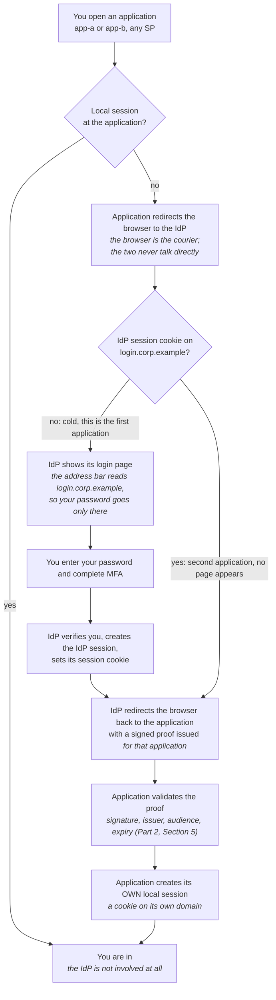

# Single Sign-On (SSO): Complete Tutorial

> Last updated: 2026-08-31 | Applicable to: the field as of August 2026
> Difficulty: Beginner | Estimated time: 60 minutes reading (no hands-on in this part)

## Tutorial Overview

This tutorial covers **single sign-on (SSO)** from zero: what SSO is as a goal (one login, many
applications), why organizations adopt it and what it costs them, the web sessions and cookies every
login mechanism is built on, how SSO works mechanically with a central login server, session
cookies, and redirects, what federation is and how trust between
organizations is established, a high-level map of the protocols that deliver SSO (SAML, OAuth 2.0,
OIDC, Kerberos), and the honest reasons SSO is hard (session mismatch, logout, blast radius). It
closes with a decision guide for when SSO is worth it, the classic beginner pitfalls, and a
standalone cheatsheet.

*Where this sits in the series:* this is Part 3 of eight. Part 1
(`001-iam-foundations-user-management.md`) gave you the vocabulary: principal, credential, claim,
and the authentication vs authorization split. Part 2 (`002-tokens-anatomy-lifecycle.md`) taught you
the artifact: the token, how to read it, and how to validate it. This part shows the user-facing
goal those pieces serve: one login for many applications. The mechanisms that deliver it come next:
Part 4 (OAuth 2.0) and Part 5 (OIDC), then Part 6 assembles real login flows. Nothing here requires
any of those later parts.

After completing this tutorial, you will be able to:

- Explain what SSO is and what it is not.
- Explain what a web session and a cookie are, what each holds, and why a cookie set on one domain
  never reaches another.
- Describe the IdP and Service Provider roles, and trace step by step what happens when a user logs
  into app A and then visits app B.
- Explain federation: how one identity crosses an organizational boundary.
- Position SAML, OAuth 2.0, OIDC, and Kerberos on one map, without protocol depth.
- Decide when SSO is worth it, and name its costs (single point of failure, blast radius).

**How to read it:** Part 1 and Part 2 are sequential and carry the concepts. Part 3 is a decision
guide plus pitfalls; Part 4 is reference material you return to. There is deliberately no hands-on
track here (Section 14 explains why).

---

## Table of Contents

- Part 1: Foundations
  - 1. What is SSO?
  - 2. Why SSO, and what it costs
  - 3. Sessions and cookies: the prerequisite
  - 4. How SSO works at a high level
  - 5. Federation and trust
  - 6. The protocol map (high level only)
  - 7. Why SSO is hard (the honest part)
- Part 2: The Landscape (SSO protocols)
  - 8. The map: three lanes
  - 9. SAML: the enterprise veteran
  - 10. OpenID Connect: the modern default
  - 11. Kerberos: the corporate network workhorse
  - 12. Honorable mentions
- Part 3: Putting It Into Practice
  - 13. How to choose: when SSO is worth it
  - 14. A note on hands-on for this part
  - 15. Common misconceptions and pitfalls
- Part 4: Reference
  - 16. Advanced topics and learning path
  - 17. Cheatsheet
  - Appendix: Glossary and sources

---

# Part 1: Foundations

## 1. What is SSO?

**Objective:** state what SSO is, what problem it answers, and what it is not.

**Single sign-on (SSO)** is an arrangement where a user authenticates once with a central login
service, and every application that trusts that service lets the user in without asking for a
password again.

The one-sentence mental model:

> SSO is one passport for many border crossings: you prove who you are once, at the passport office,
> and each border accepts the passport instead of re-interviewing you.

**A real-life picture: the passport.** You do not carry a separate identity document for every
country you visit. You prove your identity once, thoroughly, to your government's passport office.
After that, each border guard checks the passport, not your life story. Mapping the analogy back,
element by element:

- **The passport office.** The central login service (the identity provider, Section 4), the only
  place that ever sees your password.
- **The passport itself.** The proof of your session at the login service, in practice a cookie in
  your browser (Section 3 explains sessions and cookies from scratch).
- **The border guard.** Each application, which never sees your password; it only checks whether
  the login service vouches for you.
- **The entry stamp.** The token or assertion the login service hands to each application
  individually, so the application can record *who entered here* (Part 2 of this series,
  `002-tokens-anatomy-lifecycle.md`, covers these artifacts in depth).
- **Each country's own entry records.** Each application's own local session. Applications still
  track you separately once you are in; SSO only removes the repeated login.

Two properties follow from the definition:

| Property | Meaning |
|---|---|
| **One authentication** | The user proves identity once per SSO session, not once per application |
| **Many applications** | Every trusting application gets its own proof and keeps its own session |

And three things SSO is not, because beginners conflate them:

| Looks like SSO | Why it is not |
|---|---|
| **A password manager** | Fills in a *separate password per site*; every site still runs its own login. No central session exists |
| **MFA (multi-factor authentication)** | Strengthens *one* login with extra factors (Part 1, Section 4); it says nothing about how many applications share that login |
| **Same password everywhere** | Password reuse is the disease, not the cure: one leak exposes every account, and no central control exists |

**Self-check:** your company rolls out a password manager. Did you get SSO? (No: each application
still runs its own login with its own password; the manager just types for you. Nothing is shared
between applications.)

---

## 2. Why SSO, and what it costs

**Objective:** name the real benefits of SSO and the price you pay for each.

SSO exists because per-application passwords fail at scale, for users and for administrators.

**The benefits:**

- **User experience.** One login per work session instead of one per application. A 2019 Google and
  Harris Poll survey found 52% of people reuse the same password for multiple accounts and 13% use
  one password for all accounts: when logging in is annoying, users route around security. Removing
  the repeated login removes the incentive to reuse.
- **Centralized policy.** Password strength, MFA, and lockout rules are enforced in exactly one
  place, the identity provider, instead of being configured (and forgotten) in every application.
- **Centralized offboarding.** When someone leaves, disabling one account at the identity provider
  cuts access to every connected application at once. Compare Part 1, Section 5: deprovisioning is
  the lifecycle stage companies most often miss, and missed deprovisioning leaves ex-employees with
  live access.
- **Reduced password sprawl.** Fewer passwords means fewer resets, fewer help-desk tickets, and
  fewer sticky notes.

**The costs** (every benefit above has its price):

| Benefit | The cost it carries |
|---|---|
| One login for everything | **Single point of failure**: when the identity provider is down, *every* application is closed, not just one |
| One account opens everything | **Blast radius**: one compromised SSO account hands the attacker every connected application at once |
| Central policy | Central dependency: applications can no longer function independently of the identity provider |
| Central offboarding | If the identity provider itself is misconfigured, the mistake applies everywhere at once |

The arithmetic of the blast radius is simple and worth stating plainly: without SSO, one stolen
password exposes the one application it belongs to. With SSO across 30 applications, one stolen SSO
login exposes all 30. This is not an argument against SSO; it is an argument that the identity
provider must be the best-defended system you run (MFA everywhere, Section 7), because it holds the
keys to everything.

**Self-check:** your manager says SSO removes authentication risk. Is that right? (No: it
concentrates the risk in one place, the identity provider. That is a good trade only if you then
defend that place accordingly.)

---

## 3. Sessions and cookies: the prerequisite

**Objective:** explain what a web session and a cookie are, what each one holds, and why a cookie
set on one domain never reaches another.

Every section after this one rests on two web mechanisms that predate SSO by decades. If "session
cookie" is a phrase you have nodded at without being able to define, read this section slowly. If
you can already say what `Set-Cookie` does and why `app-a.corp.example` cannot read a cookie
belonging to `login.corp.example`, skip to Section 4.

The one-sentence mental model:

> The **session** is the record the server keeps about you. The **cookie** is the ticket your
> browser carries so the server can find that record again.

**Why either exists: HTTP forgets.** HTTP is **stateless**: each request arrives at the server as a
complete stranger, carrying no memory of the request before it. Loading one page can be dozens of
requests, and the server has no built-in way to know they came from the same person. Without
something to bridge them, the only way to prove who you are on request 2 would be to send your
password again, and again on request 3, and on every image and API call after that. Sessions and
cookies exist so that something *other than your password* is what gets sent on those requests.

**A real-life picture: the cloakroom.** You hand over your coat once at the counter and get a
numbered ticket. Mapping the analogy back, element by element:

- **The coat.** Your authenticated identity, established once at the counter (the login).
- **The shelf the coat sits on, and the counter's ledger.** The **session**: the record the server
  keeps, on its side, saying who you are and when you arrived.
- **The numbered ticket.** The **cookie**: a small thing you carry that is not the coat, only a
  reference to where the coat is.
- **Showing the ticket instead of describing your coat.** Every later request presents the ticket
  and the server looks the record up. Nobody re-checks your identity.
- **The cloakroom honors only its own tickets.** Cookies are scoped to one domain. The cafe next
  door will not accept this ticket, and cannot even read it.
- **Whoever holds the ticket gets the coat.** A cookie is a **bearer** credential, exactly like the
  tokens of Part 2: a stolen copy works as well as the original.
- **Closing time.** Sessions expire, on two separate clocks, covered below.

### Details

#### The session, in detail: server-side memory with a key

A **session** is a record the server creates when you log in and keeps until it expires or is
destroyed. It has a key, the **session ID**, and a body of state. A realistic record:

| Field | Example value | Why it is there |
|---|---|---|
| **Session ID** | `8f14e45fceea167a5a36dedd4bea2543` | The key; the only part that ever travels in the cookie |
| **Subject** | `user_1834` | Who this session belongs to (the principal, Part 1, Section 3) |
| **Authenticated at** | `2026-08-31T09:12:04Z` | How old the login is; drives the maximum lifetime clock |
| **Last seen at** | `2026-08-31T09:41:55Z` | Refreshed on each request; drives the idle clock |
| **Authentication method** | `password + totp` | Whether MFA was completed, so a sensitive action can demand more later |
| **Expires at** | `2026-08-31T19:12:04Z` | When the server stops honoring it |

Read that table twice, because the important part is what is *missing*: **none of that data is in
your browser.** The browser holds the ID and nothing else. This is what people mean by "server-side
state", and it is the property that makes a session revocable: delete the record, and the ticket in
the browser instantly refers to nothing.

Where the record physically lives is a real design decision, with a real cost each way:

| Where the session lives | What it buys | What it costs |
|---|---|---|
| **One server's memory** | Fastest, no extra infrastructure | Every restart logs everyone out, and a second server cannot see the session, so it breaks the moment you scale out |
| **A shared store** (Redis, a database table) | Every server sees every session, it survives restarts, and revocation is one delete | Another system to run, and a lookup on every request |
| **Nowhere: packed into a signed token instead** | No lookup and no store, so it scales without shared state | You cannot revoke what you do not store: exactly the self-contained token trade-off from Part 2, Section 2 |

#### The cookie, in detail: a name, a value, and a set of rules

A **cookie** is a small named string that the server asks the browser to store, and that the browser
then sends back *automatically*. It is two HTTP headers, one in each direction:

```http
# Server to browser, on the login response:
Set-Cookie: SESSIONID=8f14e45fceea167a5a36dedd4bea2543; Domain=login.corp.example; Path=/; Secure; HttpOnly; SameSite=Lax; Max-Age=1800

# Browser to server, unprompted, on every later request to that domain:
Cookie: SESSIONID=8f14e45fceea167a5a36dedd4bea2543
```

**"Automatically" is the load-bearing word.** No JavaScript runs and no application code decides:
once the cookie is stored, the browser attaches it to every matching request, including a request
triggered by a redirect from somewhere else entirely. That single behavior is what makes the silent
second login of Section 4 possible, and it is also why **cross-site request forgery (CSRF)** is a
threat at all (Part 2, Section 7): the browser sends the cookie even when an attacker's page
provoked the request.

The rules after the value are the attributes, and each one is a security decision:

| Attribute | What it does | The cost of getting it wrong |
|---|---|---|
| **`Domain`** | Names the host the cookie is sent to | Too broad and every subdomain sees it; too narrow and your own site stops recognizing users |
| **`Path`** | Limits it to a URL prefix | Rarely a real boundary; never treat it as a security control |
| **`Max-Age` / `Expires`** | How long the browser keeps it | Absent means it dies when the browser closes; a long value leaves a live ticket on a shared machine |
| **`Secure`** | Sends it only over HTTPS | Without it the cookie crosses plain HTTP, and anyone on the network path can copy it |
| **`HttpOnly`** | Hides it from JavaScript | Without it, one **cross-site scripting (XSS)** hole hands your session to injected script |
| **`SameSite`** | Controls whether it is sent on requests originating from other sites | `None` without care invites CSRF; `Strict` breaks legitimate redirect-back flows, SSO among them |

Two facts about shape worth carrying: browsers cap a cookie near **4 KB**, and it is sent on *every*
matching request. Both are arguments for putting a short opaque ID in the cookie rather than a fat
token.

#### The relation: the cookie carries the key, the session holds the data

Put the two together and the whole mechanism is five steps:

1. You submit your password. The server verifies it.
2. The server creates the session record and generates a random session ID.
3. The response carries `Set-Cookie: SESSIONID=<the id>`, and the browser stores it.
4. On every later request to that domain, the browser sends `Cookie: SESSIONID=<the id>`.
5. The server looks the record up by that ID and knows who you are, without seeing your password
   again.

There is a second design in the wild, and you will meet both: the cookie can carry a **signed
self-contained token** instead of an ID, in which case step 5 involves no lookup at all because the
data is inside the cookie itself. That is the opaque-versus-self-contained split of Part 2,
Section 2, moved into a cookie. It buys statelessness and costs you revocation, exactly as it did
there.

#### The domain rule, and why SSO needs redirects at all

This is the part to keep. **A cookie is sent only to the domain it was set on.** A cookie set with
`Domain=login.corp.example` goes to `login.corp.example` and nowhere else. `app-a.corp.example`
never receives it, cannot read it, and has no way to ask for it. Browsers enforce this; it is not a
convention and not a setting you can talk your way around.

Two consequences run through the rest of this tutorial:

1. **App A cannot check your IdP session by itself.** It has no access to the IdP's cookie. The only
   way for that cookie to be consulted is for your browser to actually visit the IdP, which is why
   the flow in Section 4 is built out of redirects, and why the browser rather than the application
   is the courier.
2. **Sharing one cookie across subdomains is possible, and is not SSO.** Setting `Domain=corp.example`
   makes the cookie reach every `*.corp.example` host, and some in-house estates use exactly that as
   a shortcut. The costs are real: every subdomain receives the cookie on every request, including a
   compromised one or one run by a team you do not control, and the trick does nothing whatsoever
   across organizations or for SaaS applications living on their own domains. Real SSO redirects and
   issues a separate proof per application precisely so that no cookie has to be shared.

#### "Session cookie" means two different things

The phrase is genuinely ambiguous, and both meanings are in daily use:

- **A cookie that carries a session ID.** This is how this tutorial uses the term, and how most
  people use it in conversation.
- **A cookie with no `Expires` or `Max-Age`**, which the browser deletes when it closes. This is the
  formal meaning in RFC 6265, where its opposite is a **persistent cookie**.

An IdP session cookie is frequently both at once, which is why nobody notices the ambiguity until it
causes an argument.

#### Session lifetime: two clocks, not one

Sessions almost always run two timers, and confusing them is the source of the "why was I logged
out?" complaints in Section 7:

| Clock | What it measures | What raising it costs you |
|---|---|---|
| **Idle timeout** | Time since the last request; every request resets it | Convenience goes up, but an abandoned browser on a shared desk stays logged in longer |
| **Maximum (absolute) lifetime** | Time since the login itself; nothing resets it | Fewer interruptions, but a stolen session stays useful for longer and a revoked user keeps working until it fires |

Concrete defaults, as of August 2026: **Keycloak 26.x** ships an SSO session idle timeout of **30
minutes** and a maximum of **10 hours**. Verify against your own version before relying on either;
they move between releases.

### Real use cases

1. *A user reports being logged out of the internal portal every lunch break.* The idle timeout is
   30 minutes and lunch is longer. Nothing is broken: the two clocks above name the setting to
   change, and the trade-off you accept by changing it.
2. *A security review asks you to log a compromised user out everywhere, immediately.* If sessions
   live in a shared store, that is one delete per record. If the design packed everything into
   signed cookies, there is no record to delete, which is the revocation problem you meet again in
   Section 7.
3. *A team moves the login form to `app-a.corp.example` and users stop being recognized on
   `www.corp.example`.* The `Domain` attribute is the entire explanation: the cookie was set on a
   host that the other host never sends to.

**Self-check:** you log into the IdP, then open developer tools on `app-a.corp.example` and look for
the IdP's session cookie. It is not there. Is something broken? (No: that is the domain rule working
correctly. The cookie belongs to `login.corp.example` and is only ever sent there, which is exactly
why app A has to redirect your browser to the IdP instead of checking for itself.)

---

## 4. How SSO works at a high level

**Objective:** describe the IdP/SP roles and trace a login across two applications.

Two roles do all the work:

- **The identity provider (IdP)** is the central service that authenticates the user: it shows the
  login page, checks the password and MFA, and remembers that the user is logged in. Examples you
  will meet later in the series: Keycloak, AWS Cognito, Entra ID, Okta.
- **The service provider (SP)** is any application that relies on the IdP instead of running its
  own login. In some protocols the same role is called the **relying party (RP)**; the terms are
  interchangeable for our purposes.

The glue between them is three mechanisms, none of them exotic:

**1. The IdP session.** When the IdP verifies your password, it creates a session on its side and
hands your browser a **session cookie** set on the IdP's own domain (say, `login.corp.example`).
This is the session and cookie pair of Section 3, nothing more exotic: it is how the IdP recognizes
you on later visits without asking for the password again. The domain rule from that section is what
makes the rest of this section necessary, because `app-a.corp.example` can never see that cookie.

**2. Redirects.** Applications never show a password form. When you arrive without a local session,
the application redirects your whole browser to the IdP. When the IdP is satisfied, it redirects the
browser back to the application, carrying proof of the login. The browser is the courier; the
application and the IdP often never talk to each other directly for the login itself.

**3. Proof artifacts.** What the redirect carries back is a signed token or assertion (Part 2 of
this series). The application validates it exactly as Part 2, Section 5 taught: verify the
signature, check the issuer, audience, and expiry. Only then does the application create its own
local session for you.

### A full trace, end to end

Logging into app A, from cold:

1. You open `app-a.corp.example`. App A finds no local session for you.
2. App A redirects your browser to the IdP: `login.corp.example/...?app=A` (in practice, protocol
   parameters; Parts 4 and 5 show them).
3. The IdP finds no IdP session cookie, so it shows its login page. Notice: the address bar says
   `login.corp.example`, and your password goes only there, never to app A.
4. You enter your password and complete MFA.
5. The IdP verifies you, creates the IdP session, and sets its session cookie on
   `login.corp.example`.
6. The IdP redirects your browser back to app A, carrying a signed proof of the login.
7. App A validates the proof (signature, issuer, audience, expiry) and creates *its own* local
   session for you, usually as a cookie on `app-a.corp.example`.
8. You work in app A. The IdP is no longer involved until the local session expires.

Now you visit app B, and this is where SSO earns its name:

1. You open `app-b.corp.example`. App B finds no local session.
2. App B redirects your browser to the IdP, exactly as app A did.
3. This time the IdP *does* find its session cookie from step 5 above. No login page appears.
4. The IdP immediately redirects back to app B with a fresh signed proof, issued for app B.
5. App B validates it and creates its own local session. You are in, and you never typed anything.

The whole second flow usually completes in under a second; users perceive it as "I was already
logged in".

Both traces are the *same* flow. Drawn as a chart, the only thing that separates the cold login from
the silent one is a single decision node:



Three things to read off the chart:

- **Node D is the whole of "single" sign-on.** Every application walks the identical path; app B's
  login is silent purely because the cookie set at node G is already there. Remove that cookie and
  app B gets the full login page, exactly like app A did.
- **The left branch (E, F, G) runs once per IdP session, not once per application.** That is the
  entire saving. Everything else on the chart runs every time, for every application.
- **Node J is per-application and node B is checked first.** Each application ends up holding its
  own separate session, which is why the chart converges on Z from two directions, and why logout
  is hard (Section 7): clearing the IdP cookie at node D does nothing to the sessions already
  created at node J.

**The one insight to keep:** there is no shared session between the applications. App A and app B
each keep their own session and never see your password. The only thing they share is the IdP, and
the only thing that makes it "single" sign-on is the IdP's session cookie. When logout seems broken
later (Section 7), this separation is exactly why.

**Self-check:** app B never saw your password and never asked app A anything. How does app B know
who you are? (From the signed proof the IdP issued for it after recognizing the IdP session cookie;
app B trusts the IdP, not app A, and not the browser's word.)

---

## 5. Federation and trust

**Objective:** explain how an identity crosses an organizational boundary, and what "trust" means
concretely.

Everything so far lived inside one organization: its IdP, its applications. **Federation** is the
same idea across organizations: organization A's users log into organization B's application, using
A's IdP, without B ever storing a password for them.

The passport analogy extends naturally: a German passport works in France not because France knows
every German citizen, but because France decided to trust Germany's passport office. Federation is
that decision, made between two systems.

Concretely, **trust** between an IdP and an application is established up front, by administrators,
through three ingredients:

| Ingredient | What it is |
|---|---|
| **Metadata exchange** | Each side publishes (or hands over) a document naming its endpoints, its identifiers, and the certificates or public keys it signs proofs with. Both sides import the other's metadata once, at setup time |
| **Key/certificate pinning** | Because the keys are known in advance, an application can verify a proof's signature without calling the IdP on every login; this is exactly the signature verification of Part 2, Section 5 |
| **Attribute mapping and account linking** | The two sides agree which claims travel (email, name, groups) and how an incoming identity maps to a local account: is `ada@uni-a.example` the same person as the local account `ada`? This matching step is called **account linking** |

After trust is established, the login flow is the same as Section 4, with one extra hop: B's
application redirects to B's own entry point, which redirects onward to A's IdP, which authenticates
the user and sends a signed proof all the way back. B's application validates it against A's
published keys. No password ever crosses the organizational boundary.

### Real use cases

1. *eduroam.* A student from one university opens the Wi-Fi at a university on another continent
   and logs in with their home credentials. Thousands of institutions federate so that no campus
   ever stores foreign passwords; authentication always happens at the home institution.
2. *B2B partner portals.* A manufacturer lets supplier employees into its ordering portal. The
   supplier's own IdP authenticates them; the portal only trusts and maps. When a supplier employee
   leaves their company, their access to the portal dies with their home account, with no
   offboarding ticket on the manufacturer's side.
3. *Mergers and acquisitions.* On day one after an acquisition, the acquired company's staff need
   the parent's tools. Federating the two IdPs is far faster than migrating thousands of accounts
   (a user-management migration is the Part 1, Section 5 problem nobody wants under time pressure).

**Self-check:** in a federation between company A (users) and company B (application), whose
password database does B consult at login? (None: B never sees a password. B validates a signed
proof from A's IdP against keys exchanged when trust was set up.)

---

## 6. The protocol map (high level only)

**Objective:** place SAML, OAuth 2.0, OIDC, and Kerberos on one map and know which question each
answers.

SSO is the goal; protocols are the mechanisms that deliver it. Four names dominate, and they do not
compete on equal terms, they answer different questions:

| Protocol | Standardized | Artifact it moves | Built for | Depth in this series |
|---|---|---|---|---|
| **SAML 2.0** | OASIS, March 2005 | Signed XML assertion | Enterprise web SSO, browser-based | Landscape here (Section 9); positioning in Part 5 |
| **OAuth 2.0** | RFC 6749, October 2012 | Access tokens | Delegated *API access*, not login | Part 4 (full treatment) |
| **OpenID Connect (OIDC)** | OpenID Foundation, February 2014 | ID token (a JWT) + access tokens | Login for the modern web and mobile | Part 5 (full treatment) |
| **Kerberos** | RFC 4120, July 2005 | Tickets | Corporate networks: Windows domains, file shares, internal services | This section only |

One paragraph each, no more:

**SAML 2.0.** The enterprise veteran: the browser is bounced between application and IdP with
redirects, and the proof carried back is a signed XML document called an assertion. Verbose,
XML-heavy, extremely widely deployed in large companies and government. If you join an enterprise,
SAML is already there.

**OAuth 2.0.** Not a login protocol. It answers "may this app call that API on my behalf?" and
issues access tokens for that. People *do* build login experiences on it (social login leans on it),
but OAuth alone never tells the application who the user is; that gap is precisely what OIDC fills.
Do not say "we will do SSO with OAuth": that sentence is the series' most common misconception
(Section 15, Pitfall 1).

**OpenID Connect (OIDC).** A thin authentication layer on top of OAuth 2.0. It reuses OAuth's flows
and adds an ID token, a JWT (you can already read one, thanks to Part 2) that states who logged in,
when, and how. This is the modern default for web and mobile SSO, and it is where the series goes
next in depth (Parts 4 and 5).

**Kerberos.** The corporate-network workhorse, older than the web SSO world: inside a Windows/Active
Directory domain, your workstation logs in once at machine sign-in, and tickets from the domain
controller get you into file shares, internal apps, and databases without re-entering anything.
Different world (tickets, not tokens; networks, not browsers), same goal.

**Self-check:** a colleague proposes "doing SSO with OAuth 2.0". What is imprecise about the
sentence? (OAuth 2.0 is delegated authorization and does not by itself authenticate a user; the SSO
login you actually want is delivered by OIDC on top of OAuth, or by SAML in an enterprise estate.)

---

## 7. Why SSO is hard (the honest part)

**Objective:** name the three failure modes that bite real SSO deployments, with numbers.

SSO demos beautifully and then bites in production, in three predictable places.

**Session lifetime mismatch.** The IdP session, each application's local session, and each
application's tokens all expire on different clocks. Keycloak's defaults make this concrete
(Keycloak Server Administration Guide 26.x, already cited in Part 2): access token lifespan 5
minutes, SSO session idle 30 minutes, SSO session max 10 hours. So a user can be "logged in" at the
IdP, logged out of app A (local session expired), and holding an expired token in app B, all at the
same moment. Neither "logged in" nor "logged out" is a single state; it is three separate timers,
and every confusing support ticket about random logouts is a timer disagreement.

**Logout does not propagate.** Remember Section 4's insight: applications keep their own local
sessions, and they never talk to each other. Clicking "log out" in app A clears app A's session. App
B's session knows nothing about it and keeps working until its own timer dies. Protocols have
answers (single logout mechanisms, covered properly in Part 5, Section 7), but they are fiddly and
often not configured. The safe assumption for any design you make this year: logout in one app does
not log the user out everywhere.

**Blast radius is real, and IdPs are attacked as IdPs.** Centralizing authentication makes the IdP
the highest-value target in the estate, and attackers know it. In October 2023, attackers breached
Okta's customer support system and stole session tokens that customers had uploaded inside HAR
troubleshooting files; Okta's disclosure put the number of impacted customers at 134, under 1% of
its customer base. The lesson is not "Okta is bad"; it is that session material around an IdP is
worth stealing precisely because one session opens many doors. The corresponding defense has a hard
number too: Microsoft reported in 2019 that MFA blocks over 99.9% of automated account-compromise
attacks. If the blast radius of one account is every application, MFA at the IdP is the single
highest-leverage control you have. An SSO rollout without enforced MFA is a bigger, softer target
than the password sprawl it replaced.

**Self-check:** a user says "I logged out, why is the other app still open?" Which of the three
failure modes is this? (Logout not propagating: each application holds its own local session and its
own timer; logging out of one clears only that one.)

---

# Part 2: The Landscape (SSO protocols)

This Part positions the three SSO protocol families you will actually meet. It is deliberately
positioning only: the deep dives on OAuth 2.0 and OIDC are Parts 4 and 5 of this series, and SAML
stays at positioning depth by design. Versions and dates are stamped because this Part goes stale
first.

## 8. The map: three lanes

The field organizes into three lanes, distinguished by *where the login happens*:

| Lane | Question it answers | Protocol | Typical home |
|---|---|---|---|
| **Enterprise web SSO** | "Log my workforce into browser apps, ours and SaaS" | SAML 2.0 | Large enterprises, government, education |
| **Modern web and mobile SSO** | "Log users into my SPA, mobile app, and APIs" | OpenID Connect | Greenfield products, B2C, modern enterprises |
| **Corporate network SSO** | "Log my staff into the Windows domain and everything on it" | Kerberos | Any organization running Active Directory |

Real organizations run two lanes at once: Kerberos inside the corporate network, and SAML or OIDC
for browser applications, often bridged by one IdP product that speaks all three.

---

## 9. SAML: the enterprise veteran

**What it is.** **SAML** 2.0 (Security Assertion Markup Language, OASIS standard, March 2005) is the
enterprise SSO protocol: the browser is redirected to the IdP, and the proof carried back is a
signed XML **assertion** containing the user's identity and attributes.

**Who it is for.** Large enterprises, government, and education, especially where SaaS vendors
(Salesforce, Workday, and peers) are integrated into a central IdP. If a SaaS product's
administration console says "SSO", it almost certainly means SAML first.

**What it costs you.** XML is verbose and its signature validation is famously easy to get subtly
wrong (XML canonicalization and wrapping attacks have their own CVE history). SAML also carries no
standard mechanism for mobile apps or API access tokens; it is a browser login protocol and stops
there.

**Era stamp.** SAML 2.0 is frozen since 2005 and not being replaced inside existing estates; new
greenfield work defaults to OIDC instead.

---

## 10. OpenID Connect: the modern default

**What it is.** **OpenID Connect (OIDC)**, finalized by the OpenID Foundation in February 2014, is a
thin authentication layer on top of OAuth 2.0. It reuses OAuth's flows and endpoints and adds one
thing OAuth lacks: an ID token, a signed JWT stating who logged in. You already have every skill
needed to read one (Part 2, Section 3).

**Who it is for.** Anyone building login today: SPAs, mobile apps, consumer products, and
increasingly the same enterprises that run SAML for their legacy SaaS estate. Every major managed
IdP (Keycloak, Entra ID, Okta, Cognito) speaks OIDC.

**What it costs you.** You inherit OAuth 2.0's complexity: redirect flows, client registrations,
PKCE, and token handling all have sharp edges. That complexity is exactly what Parts 4 and 5 of
this series exist to defuse, so here it stays a one-line forward pointer.

**Era stamp.** OIDC Core 1.0 dates from February 2014 (with later errata) and is the stable default;
the moving parts around it (PKCE requirements, logout drafts) are covered, dated, in Part 5.

---

## 11. Kerberos: the corporate network workhorse

**What it is.** **Kerberos** (RFC 4120, July 2005; the design dates to 1980s MIT) is network SSO:
you authenticate once, typically when you sign into your Windows workstation, and the domain
controller's ticket-granting service issues short-lived **tickets** that get you into file shares,
internal applications, and databases without another password prompt.

**Who it is for.** Any organization running Active Directory or a compatible domain. If you have
ever opened a network share at work without typing a password, you used Kerberos.

**What it costs you.** Kerberos lives inside the corporate network perimeter and does not extend
cleanly to browsers, mobile, or the internet; it also puts absolute trust in clock synchronization
and in the domain controller, whose compromise is a domain-wide event.

**Era stamp.** Effectively frozen and ubiquitous: not growing, not going away.

---

## 12. Honorable mentions

One line each, so the map has no obvious holes:

- **Social login ("Sign in with Google/GitHub/Apple").** Consumer-facing federation: your product
  acts as a relying party to a public IdP. Underneath it is OIDC (or OAuth plus a profile endpoint),
  so its mechanics arrive in Parts 4 and 5.
- **Enterprise federation hubs / identity brokering.** IdP products that speak SAML on one side and
  OIDC on the other, or chain multiple IdPs, so old and new estates share one login. Keycloak calls
  this identity brokering; it returns in Part 6.
- **CAS (Central Authentication Service).** A university-era SSO protocol still found in academia;
  largely superseded by SAML and OIDC.
- **Smart-card / certificate SSO.** Login by hardware certificate (government, defense): same "prove
  once, reuse everywhere" pattern with possession-factor credentials (Part 1, Section 4).

---

# Part 3: Putting It Into Practice

## 13. How to choose: when SSO is worth it

**Objective:** decide, for a concrete situation, whether SSO is worth its cost.

SSO is not free: you now run (or rent) an IdP that must never go down and must be defended like the
keys to everything, because it is (Section 2). The decision turns on application count, team size,
and compliance drivers:

| Your situation | Start with |
|---|---|
| One application, small team | **No SSO.** Per-app accounts from Part 1 are fine; spend the effort on MFA and password hashing instead |
| 2-4 internal applications, one team | **Lightweight SSO** via a managed IdP (Auth0/Okta/Cognito tier) or Keycloak; centralized offboarding alone usually justifies it |
| 5+ applications, or any compliance regime (SOC 2, ISO 27001) with offboarding SLAs | **SSO is effectively mandatory.** Auditors ask "how do you revoke a leaver's access, everywhere, today?", and per-app accounts have no good answer |
| Customers logging into your product (B2C) | **OIDC login via a managed IdP**, designed in Part 6; do not build password auth yourself |
| Corporate Windows network | **Kerberos is already there**; extend it, do not parallel it |
| Workforce + many SaaS tools | **SAML federation** from your IdP to each SaaS (Section 9), OIDC for anything new you build |

Two practical truths:

1. **The concepts transfer across protocols.** IdP, service provider, session cookie, signed proof,
   metadata trust: SAML, OIDC, and Kerberos all assemble the same five pieces differently. Learn the
   pieces once (this tutorial) and each protocol becomes "which artifact, which encoding".
2. **The IdP becomes tier-zero infrastructure.** Budget for its availability and its MFA policy the
   day you adopt it, not after the first outage or the first compromised account (Section 7).

---

## 14. A note on hands-on for this part

There is deliberately no hands-on track in this tutorial. Every meaningful SSO exercise needs a
running identity provider, and the series sets that up exactly once: Part 4's hands-on track brings
up the canonical local Keycloak stack (`hands-on/`, Docker, pinned version), and Part 6 builds the
full browser-to-application login flows on it. If you want something to *do* today, do this instead:

- Watch your own browser: open your company or university portal, open the developer tools' network
  tab, and find the redirect chain from Section 4 (application to IdP, IdP back with an artifact).
  Then open a second application and watch step 3 of the second flow: no login page, straight back.

That ten-minute observation exercises Sections 1, 3, and 5 with zero setup.

---

## 15. Common misconceptions and pitfalls

**Pitfall 1: "SSO means OAuth."**
Symptom: the team says "we will do SSO with OAuth" and, when asked how the login actually happens,
cannot say. Cause: OAuth 2.0 is delegated *authorization* (may this app call that API?), not
authentication; it never tells the application who the user is. Fix: SSO is the goal; the login
mechanism is OIDC (Part 5) on the modern web or SAML in an enterprise estate. Re-read Section 6.

**Pitfall 2: assuming logout logs out everywhere.**
Symptom: a user clicks "log out" in app A, walks away, and app B still works for the next person at
the machine. Cause: applications hold their own local sessions on their own timers; nothing connects
app A's logout to app B. Fix: keep local sessions short, treat "logged out everywhere" as a feature
that must be explicitly built (single logout, Part 5, Section 7), and never promise it by default.
Re-read Sections 3 and 6.

**Pitfall 3: ignoring the IdP as a single point of failure.**
Symptom: an IdP outage closes every application at once and nobody has a runbook; or the IdP is
administered casually while the apps behind it are hardened. Cause: centralization concentrates
availability risk and compromise impact by design (Section 2). Fix: run the IdP highly available,
monitor it like production authentication itself (it is), enforce MFA on it, and rehearse its
outage. Re-read Sections 2 and 6.

**Pitfall 4: MFA as an afterthought.**
Symptom: SSO ships with password-only login "for now", multiplying the blast radius of every
credential-stuffing attack across all connected applications. Cause: the rollout centralizes the
keys without strengthening the lock. Fix: enforce MFA at the IdP before connecting the second
application; Microsoft's figure (MFA blocks over 99.9% of automated account-compromise attacks) is
the business case in one line. Re-read Section 7.

---

# Part 4: Reference

## 16. Advanced topics and learning path

**Recommended learning order:** Part 4 of this series (OAuth 2.0, `004-oauth-2-part-1.md`) to Part 5
(OIDC, `005-openid-connect-oidc.md`) to Part 6 (real sign-up and login flows with Keycloak,
`006-signup-login-flows-end-to-end.md`). Mechanism before assembly: you now know the goal (SSO) and
the artifact (tokens, Part 2); next you learn the protocol that issues and moves the artifact, then
the authentication layer on top of it, then you build it.

**Direction 1: OAuth 2.0 and OIDC (the direct continuation).** The two protocols behind modern SSO,
with full flow traces. Covered by Parts 4 and 5 of this series; no external reading needed first.

**Direction 2: SAML in depth.** | Difficulty: Intermediate. XML assertions, metadata, signing and
encryption, and the enterprise integration patterns this series deliberately leaves at positioning
depth. Recommended resources: the OASIS SAML 2.0 specifications and the SAML chapter of your IdP's
documentation (Keycloak and Entra ID both document their SAML setups well).

**Direction 3: Federation operations.** | Difficulty: Intermediate/Advanced. Identity brokering,
attribute mapping at scale, cross-organization account linking and its failure modes (duplicate
accounts, stale external identities). Recommended resources: your IdP's federation documentation;
the REFEDS and eduroam materials are the public gold standard for large-scale federation.

**Best practices:**

- Enforce MFA at the identity provider before connecting additional applications.
- Keep application-local sessions short, and design logout expectations explicitly.
- Exchange and review federation metadata deliberately: keys and endpoints are trust decisions, not
  plumbing.
- Monitor the IdP as tier-zero infrastructure: availability, sign-in anomalies, and admin actions.
- Never let an application see user passwords once SSO exists; redirect, do not embed login forms.

---

## 17. Cheatsheet

**Definition:** single sign-on (SSO) is an arrangement where a user authenticates once with a
central login service, and every application that trusts that service lets the user in without
asking for a password again.

**The flow in under ten lines:**

```text
App A: no local session -> redirect browser to IdP
IdP:   no IdP session   -> show login page, verify password + MFA
IdP:   create IdP session, set cookie on IdP domain
IdP:   redirect back to App A with signed proof -> App A validates -> local session
App B: no local session -> redirect browser to IdP
IdP:   session cookie present -> NO login page -> fresh proof for App B
App B: validates -> local session. User typed nothing.
```

**Roles:** identity provider (IdP) authenticates and holds the session; service provider / relying
party (SP/RP) trusts the IdP and keeps its own local session.

**Sessions and cookies in one line each:** the session is the server-side record (subject, login
time, authentication method, expiry); the cookie is the ticket carrying its ID; a cookie is sent
only to the domain that set it, which is the entire reason SSO is built out of redirects.

**The three hard parts:** session timers disagree (Keycloak defaults: access token 5 min, SSO idle
30 min, SSO max 10 h); logout does not propagate; one account opens every app, so MFA at the IdP is
non-negotiable.

**Key numbers:** MFA blocks over 99.9% of automated account-compromise attacks (Microsoft, 2019);
134 customers were impacted when session tokens were stolen from Okta's support system (October
2023), proof that material around an IdP is targeted precisely because one session opens many doors.

**Version landmarks (as of August 2026):**

| Thing | Milestone |
|---|---|
| SAML 2.0 | OASIS standard, March 2005; frozen, still the enterprise default |
| Kerberos v5 | RFC 4120, July 2005; ubiquitous in Windows/AD networks |
| OAuth 2.0 | RFC 6749, October 2012; delegated authorization, not login (Part 4) |
| OpenID Connect Core 1.0 | February 2014; the modern login default (Part 5) |
| Keycloak 26.x | Series workhorse IdP; SSO session defaults 30 min idle / 10 h max |

**Quick troubleshooting:**

| Symptom | Likely cause | Quick fix |
|---|---|---|
| User re-prompted for password in second app | IdP session cookie missing or expired (idle/max timer) | Check IdP session settings; check cookie domain and SameSite |
| "Logged out" but another app still works | Logout does not propagate to local app sessions | Shorten local sessions; configure single logout (Part 5, Section 7) |
| Every app down at once | IdP outage: the designed-in single point of failure | HA IdP deployment, status page, rehearsed runbook |
| Login works for app A, rejected by app B | Federation/metadata or audience mismatch for app B | Re-check app B's registration, keys, and expected audience at the IdP |
| Random logouts mid-work | Session timer mismatch between IdP and app | Align local session, token, and IdP session lifetimes deliberately |

---

## Appendix

### Glossary

| Term | Definition |
|---|---|
| **Single sign-on (SSO)** | An arrangement where a user authenticates once with a central login service and every trusting application lets them in without asking for a password again |
| **Identity provider (IdP)** | The central service that authenticates users (password, MFA), holds the SSO session, and issues signed proofs to applications |
| **Service provider (SP)** | An application that relies on the IdP for login instead of running its own authentication |
| **Relying party (RP)** | The OIDC-world name for the same role as service provider; the terms are interchangeable here |
| **IdP session** | The server-side login state at the identity provider, recognized via a session cookie on the IdP's domain; the thing that makes the second login silent |
| **Session** | The record a server keeps about a logged-in user (subject, login time, authentication method, expiry), addressed by a session ID |
| **Session ID** | The random key identifying one session record; the only part of the session that travels to the browser |
| **Cookie** | A small named string a server asks the browser to store, which the browser then sends back automatically on every matching request |
| **Session cookie** | Either a cookie carrying a session ID (this tutorial's usage), or, formally in RFC 6265, a cookie with no expiry that the browser deletes when it closes |
| **Persistent cookie** | A cookie with `Expires` or `Max-Age` set, which survives closing the browser; the formal opposite of a session cookie |
| **Stateless (HTTP)** | The property that each HTTP request carries no memory of the one before it, which is the reason sessions and cookies exist |
| **`Set-Cookie` / `Cookie`** | The response header a server uses to store a cookie, and the request header the browser uses to send it back |
| **`HttpOnly`** | A cookie attribute hiding the cookie from JavaScript, so an XSS hole cannot read the session |
| **`Secure`** | A cookie attribute restricting the cookie to HTTPS, so it never crosses the network in the clear |
| **`SameSite`** | A cookie attribute controlling whether the cookie is sent on requests originating from other sites; the main CSRF control, and a common cause of broken redirect-back flows |
| **Idle timeout** | Session expiry measured from the last request, reset by activity |
| **Maximum (absolute) lifetime** | Session expiry measured from the login itself, which no amount of activity resets |
| **Assertion** | The signed XML identity artifact SAML delivers to an application; conceptually a self-contained token in XML (Part 2, Section 2) |
| **Federation** | SSO across organizational boundaries: organization B's application accepts identities authenticated by organization A's IdP |
| **Trust** | The pre-established administrative relationship between IdP and application: exchanged metadata, known signing keys, agreed attributes |
| **Metadata** | The document each federation party publishes naming its endpoints, identifiers, and signing keys, imported once at setup |
| **Account linking** | Matching an incoming federated identity to the correct local account during federation |
| **Password sprawl** | The proliferation of per-application passwords that drives reuse, resets, and weak choices; the problem SSO removes |
| **Single point of failure** | The property that when the IdP is down, every connected application is closed at once; the price of centralization |
| **Blast radius** | The set of applications exposed by one compromised account; with SSO it is every connected application |
| **SAML** | Security Assertion Markup Language 2.0 (OASIS, 2005): the enterprise browser-SSO protocol moving signed XML assertions |
| **OAuth 2.0** | RFC 6749 delegated-authorization framework: issues access tokens for API access, and is not by itself a login protocol (Part 4) |
| **OpenID Connect (OIDC)** | The authentication layer on OAuth 2.0 (2014) adding the ID token that states who logged in; the modern SSO default (Part 5) |
| **Kerberos** | RFC 4120 network SSO protocol: one workstation login, then tickets from the domain controller open internal services |
| **Ticket** | The short-lived artifact Kerberos issues for access to one network service |
| **Social login** | Consumer-facing federation ("Sign in with Google") where a product relies on a public IdP, built on OIDC/OAuth underneath |
| **Identity brokering** | An IdP feature chaining or translating between protocols and external IdPs, so mixed estates share one login |
| **Single logout** | Protocol mechanisms that propagate one logout to all connected applications; explicitly built, never default (Part 5, Section 7) |
| **Multi-factor authentication (MFA)** | Requiring two or more authentication factors (Part 1, Section 4); at the IdP it is the control that shrinks SSO's blast radius |

### Sources (as referenced in this tutorial)

- IETF, RFC 6265, "HTTP State Management Mechanism" (April 2011): cookies, their attributes, and
  the session-versus-persistent cookie distinction of Section 3.
- OASIS, "Security Assertion Markup Language (SAML) V2.0" (March 2005): the SAML standard and its
  XML assertions.
- IETF, RFC 6749, "The OAuth 2.0 Authorization Framework" (October 2012): OAuth as delegated
  authorization, the basis for the "OAuth is not login" claim.
- OpenID Foundation, "OpenID Connect Core 1.0" (February 2014): the authentication layer on OAuth
  2.0 and the ID token.
- IETF, RFC 4120, "The Kerberos Network Authentication Service (V5)" (July 2005): the ticket-based
  corporate network SSO protocol.
- Google and Harris Poll, "Online Security Survey" (February 2019): 52% of people reuse the same
  password for multiple accounts, 13% for all accounts.
- Microsoft (Alex Weinert), "Your Pa$$word doesn't matter" (July 2019): MFA blocks over 99.9% of
  automated account-compromise attacks.
- Okta, "Okta Support System incident" disclosures (October-November 2023): session tokens stolen
  via uploaded HAR files; 134 customers impacted.
- Keycloak, "Server Administration Guide", 26.x (accessed August 2026): default access token
  lifespan 5 minutes, SSO session idle 30 minutes, SSO session max 10 hours.
- REFEDS and eduroam documentation (accessed August 2026): large-scale academic federation in
  practice.

*Note: this tutorial reflects the field as of August 2026. Protocol standards are stable, but IdP
product defaults (Keycloak session timers), breach post-mortems, and survey figures drift; verify
version-specific claims against official documentation before building on them.*
