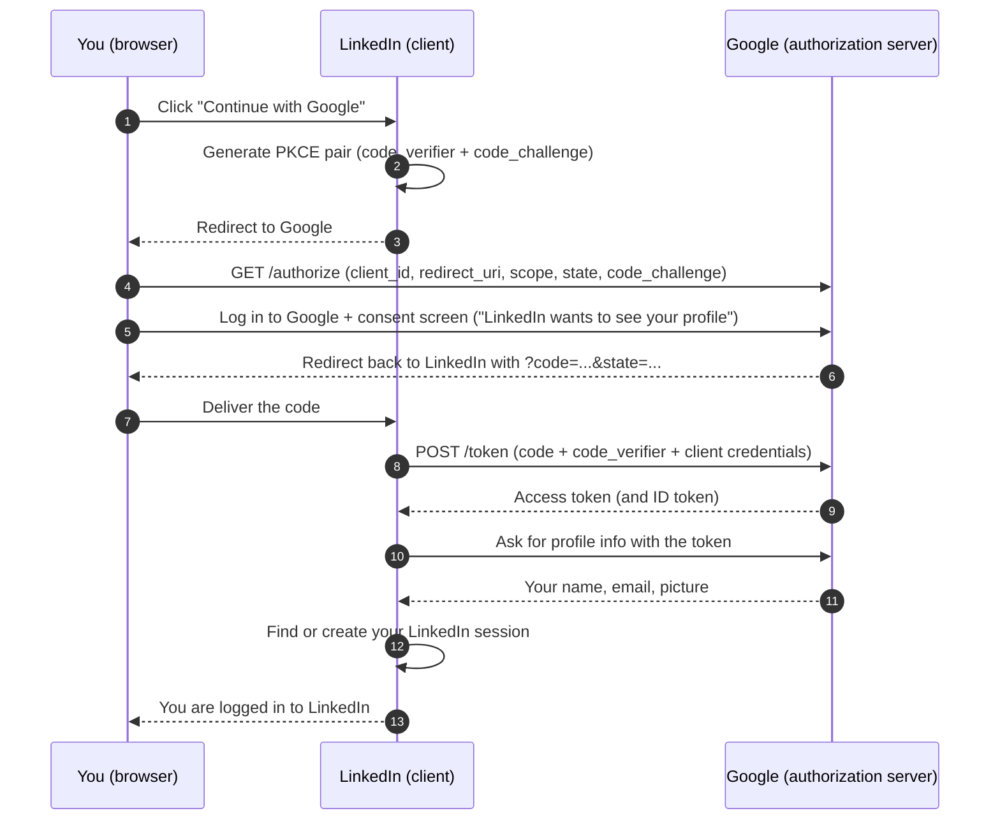
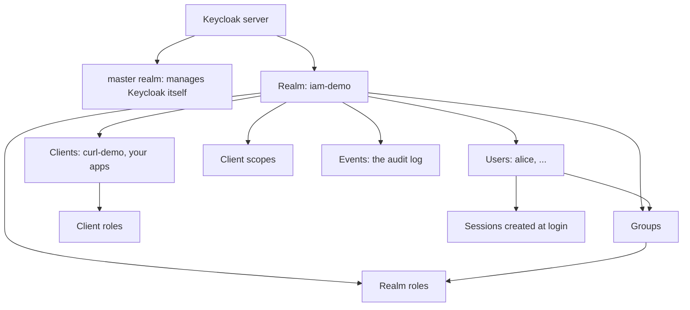

# OAuth 2.0: Complete Tutorial

> Last updated: 2026-08-30 | Applicable to: the field as of August 2026
> Difficulty: Intermediate | Estimated time: 70 minutes reading, plus 45 minutes optional hands-on

## Tutorial Overview

This tutorial covers **OAuth 2.0** from zero: the problem it solves (letting one application act on
your data at another service *without* handing over your password), why OAuth 1.0 and OAuth 2.0 are
two different protocols and not two versions of one, the four roles every OAuth conversation
involves, the grant types (which one is the modern default and which are deprecated), a complete
step-by-step trace of the authorization code flow with PKCE, what scopes and consent really mean,
and the honest section on what OAuth is not and where it breaks. It closes with a grant-type
decision guide, a hands-on track that brings up the series' local Keycloak stack and traces the
flow with `curl`, and the classic pitfalls.

*Where this sits in the series:* this is Part 4 of eight. Part 1
(`001-iam-foundations-user-management.md`) gave the vocabulary, Part 2
(`002-tokens-anatomy-lifecycle.md`) taught the artifact (tokens: reading and validating them), and
Part 3 (`003-single-sign-on-sso.md`) framed the user-facing goal (SSO) and warned that OAuth alone
is not login. This part is the first *mechanism*: the protocol that issues and moves tokens. Part 5
adds the authentication layer on top (OIDC), and Part 6 assembles real application flows. Nothing
here requires Parts 5-8.

After completing this tutorial, you will be able to:

- Explain the problem OAuth 2.0 solves and why sharing passwords was the alternative it replaced.
- Contrast OAuth 1.0 and OAuth 2.0 and explain why 2.0 is a different protocol, not a version bump.
- Name the four roles (resource owner, client, authorization server, resource server) in any OAuth
  scenario.
- Choose the right grant type, and explain why authorization code with PKCE is the default.
- Trace the authorization code flow end to end, including the PKCE exchange.
- State what OAuth 2.0 is not (authentication), and the risks that follow from bearer tokens and
  redirect handling.

**How to read it:** Part 1 (Foundations) and Part 2 (Landscape) are sequential. Part 3 is a decision
guide plus a hands-on track you can do entirely locally, free, with Docker. Part 4 is reference
material you return to.

---

## Table of Contents

- Part 1: Foundations
  - 1. What problem OAuth 2.0 solves
  - 2. OAuth 1.0 vs OAuth 2.0
  - 3. The four roles
  - 4. Grant types
  - 5. The authorization code flow, traced end to end
  - 6. Access tokens, scopes, and consent
  - 7. Why OAuth is hard, and what it is not (the honest part)
- Part 2: The Landscape (authorization servers)
  - 8. The map: three lanes
  - 9. Keycloak: the self-hosted workhorse (open source, Java)
  - 10. Auth0 / Okta: the managed identity platforms (SaaS)
  - 11. AWS Cognito: the cloud-native user directory (AWS)
  - 12. Microsoft Entra ID: the enterprise incumbent (Microsoft cloud)
  - 13. Honorable mentions
- Part 3: Putting It Into Practice
  - 14. How to choose: the grant-type decision guide
  - 15. Optional hands-on track: local Keycloak stack + authorization code flow with curl
  - 16. Common misconceptions and pitfalls
- Part 4: Reference
  - 17. Advanced topics and learning path
  - 18. Cheatsheet
  - Appendix: Glossary and sources

---

# Part 1: Foundations

## 1. What problem OAuth 2.0 solves

**Objective:** explain delegated authorization and why sharing passwords was the practice OAuth
killed.

**OAuth 2.0** is a framework for **delegated authorization**: it lets one application (say, a photo
printing service) get limited access to your data at another service (say, your photo storage)
without ever seeing your password for that service.

The one-sentence mental model:

> OAuth is the valet key of the web: you hand the parking attendant a key that starts the car and
> opens the doors, but not the trunk, and you never hand over your house keys along with it.

**A real-life picture: the valet key.** Many cars ship with a second key that drives the car but
cannot open the trunk or the glovebox. You give the valet exactly the capability the job needs,
nothing more, and you can take it back. Before valet keys, your only option was to hand over your
full keyring and hope. Mapping the analogy back, element by element:

- **Your car.** Your account and data at a service (photos at a storage provider, contacts at an
  email provider).
- **The full keyring.** Your password. Before OAuth, third-party apps literally asked for it; this
  was called the password anti-pattern, and it trained users to type passwords into random sites.
- **The valet key.** The access token (Part 2 of this series): it works, but only for what it was
  issued for.
- **The trunk that stays locked.** Scopes (Section 6): the valet key cannot open everything; a token
  issued for "read photos" cannot "delete photos".
- **The valet.** The third-party application that acts on your behalf.
- **You, handing over the key.** The consent step: delegation happens only because you approved it.

Why this matters: with password sharing, the third party *became* you (full access, no expiry, no
audit trail, and changing your password broke nothing because they stored it). With OAuth, the third
party holds a revocable, scoped, short-lived token, and the real password stays with the service
that owns it. That is the entire reason the protocol exists.

**Self-check:** a fitness app asks for your email password "to import your contacts". What should
it have asked for instead? (An OAuth delegation: you approve a "read contacts" scope at the email
provider, the app gets a limited token, and your password never leaves the provider.)

---

## 2. OAuth 1.0 vs OAuth 2.0

**Objective:** explain why OAuth 2.0 is a different protocol rather than a version bump, and what
happened to 1.0.

These two share a name and a goal (delegated access) and almost nothing else. The short history:

- **OAuth 1.0** (finalized as RFC 5849, April 2010) made the *client sign every API request*
  cryptographically: the client computed an HMAC-SHA1 signature over the method, URL, parameters,
  timestamp, and a nonce, using a shared secret. No token was ever "usable by whoever holds it",
  because each request proved possession of the secret. It worked even without TLS.
- **OAuth 1.0a** (June 2009) was an emergency fix for a session-fixation attack discovered before
  the spec even shipped, an early hint of how sharp the edges were.
- **OAuth 2.0** (RFC 6749 and RFC 6750, October 2012) deleted request signing entirely. Instead,
  the client obtains a bearer token once and sends it over TLS, which now carries the security
  burden that per-request signatures used to carry.

| | OAuth 1.0 / 1.0a | OAuth 2.0 |
|---|---|---|
| **Standard** | RFC 5849 (April 2010) | RFC 6749 + RFC 6750 (October 2012) |
| **Artifact** | Signed requests | Bearer access tokens |
| **Where the crypto lives** | In every client (request signing) | In the transport (TLS) |
| **Works without TLS** | Yes (signatures) | No (a stolen bearer token is usable as-is) |
| **Client developer experience** | Painful: signature canonicalization bugs were the norm | Simple: send a header |
| **Mobile / non-browser clients** | Poorly supported | First-class (grant types per client shape) |
| **Status today** | Retired by nearly all major providers | The universal default; RFC 9700 (January 2025) is its current security guidance |

Two things to take away:

1. **Why 2.0 won.** Request signing was the top complaint about 1.0: developers got canonicalization
   wrong constantly, and debugging a signature mismatch meant diffing invisible string orderings.
   Moving the cryptography to TLS (already mandatory in practice) made clients trivially simple and
   let the framework define different *grant types* for different client shapes (Section 4). The
   cost is real and stated honestly: bearer tokens can be stolen and replayed, which is why
   transport security, short lifetimes, and storage discipline (Part 2, Sections 6-7) are not
   optional.
2. **It is not a version bump.** The two are wire-incompatible, philosophically different (crypto
   in the client vs crypto in the transport), and were not designed to interoperate. If an old
   document says "OAuth" without a number, check the date: before ~2012 it means 1.0-style signing;
   after, it means 2.0 bearer tokens. A consolidation effort, OAuth 2.1, was still an IETF draft as
   of August 2026; its main content (PKCE mandatory, implicit and password grants removed) is
   already best practice via RFC 9700, so this tutorial teaches that practice directly.

**Self-check:** your client calls an API over plain HTTP. Which OAuth generation would still
protect the requests, and why does the answer not matter in practice? (OAuth 1.0's request
signatures survive plain HTTP; but plain HTTP is unacceptable for other reasons, and 1.0 is retired,
so in practice the answer is: use TLS, always, with 2.0.)

---

## 3. The four roles

**Objective:** name the four OAuth roles and place them correctly in any scenario.

Every OAuth conversation involves exactly four roles. Get these fixed and every diagram in the rest
of the series reads itself:

| Role | What it is | In the photo-printing example |
|---|---|---|
| **Resource owner** | The human (or entity) who owns the data and can grant access to it | You, the owner of the photos |
| **Client** | The application that *wants* access to the data | The printing service |
| **Authorization server (AS)** | The service that authenticates the owner, collects consent, and issues tokens | The photo provider's login/authorization endpoint |
| **Resource server (RS)** | The API that holds the data and accepts tokens | The photo provider's API |

Three practical notes:

- **The authorization server is the IdP from Part 3.** Different name, same job: Part 3's identity
  provider and OAuth's authorization server both authenticate the user and issue proofs. "AS" is
  the OAuth-document vocabulary; "IdP" is the product vocabulary.
- **Client type matters.** A **confidential client** can keep a secret (a server-side application
  with a client secret); a **public client** cannot (a browser SPA, a mobile app: anything whose
  code ships to the user can be read by the user). This distinction decides which grant type is
  allowed (Section 4) and drives the PKCE requirement (Section 5).
- **The client is not the user.** The most common beginner confusion: OAuth conversations are
  between *software* (client, AS, RS) *about* a user's data. The user's only speaking part is the
  login and consent at the authorization server.

**Self-check:** in "a mobile app reads your calendar via OAuth", which role is the mobile app, and
which role is the calendar API? (The app is the client; the calendar API is the resource server. You
are the resource owner; the provider's authorization server issues the token.)

---

## 4. Grant types

**Objective:** choose the right grant type for a given client, and name why the others exist or are
deprecated.

A **grant type** is the recipe a client follows to obtain an access token. OAuth 2.0 is a framework
precisely because it offers several recipes for different client shapes. Four matter to your
vocabulary; only two matter to new code:

| Grant type | For | Status (as of August 2026) |
|---|---|---|
| ***Authorization code (with PKCE)*** | Apps with a user present: web apps, SPAs, mobile apps | The default. Use it for everything with a human in it |
| ***Client credentials*** | Machine-to-machine: no user involved | Standard for service-to-service calls (Part 8 goes deeper) |
| Implicit | Browser apps of the pre-2015 era | Deprecated: RFC 9700 (January 2025) says MUST NOT use |
| Resource owner password credentials (ROPC) | Legacy migrations only | Deprecated: RFC 9700 says MUST NOT use |

### Details

#### Authorization code grant, in detail: the one you will actually use

The client never sees the user's password. The user's browser is redirected to the authorization
server, the user logs in and consents there, and the browser comes back carrying a short-lived
**authorization code**. The client then exchanges that code for tokens by calling the authorization
server directly. Section 5 traces every step.

**PKCE** ("pixie", RFC 7636, September 2015) is an add-on that is now effectively mandatory: the
client generates a random one-time secret (the code verifier), sends only its hash (the code
challenge) along with the redirect, and must present the original secret when exchanging the code.
Why: an attacker who somehow intercepts the code (a malicious app registering the same redirect on
mobile was the classic case) still cannot exchange it, because the attacker never had the verifier.
Cost: one random string and one hash per login, a few lines of code. There is no reason to skip it,
and modern authorization servers require it for public clients.

#### Client credentials grant, in detail: no human in the room

The client (a backend service) authenticates *as itself* to the authorization server with its own
client ID and secret, and gets a token for its own sake: a nightly job calling an internal API, a
CI system deploying. There is no redirect, no consent, no user, and no refresh token; the token is
simply requested again when needed. The cost: whoever holds the client secret *is* the client, so
secret storage becomes the whole security story (Part 8 covers machine access patterns in depth).

#### Implicit grant, in detail: deprecated, and why

Implicit delivered the access token *directly through the browser redirect* (in the URL fragment),
with no code exchange step. It existed because old browsers blocked the cross-site requests the
exchange step needs. That constraint died with CORS, and the design's flaws did not: tokens in URLs
leak into browser history, proxy logs, and referers. Replaced by authorization code + PKCE, which
gives browser apps everything implicit did, minus the leaks. If you see `response_type=token` in
old documentation, that is implicit; do not copy it.

#### ROPC, in detail: the password anti-pattern with extra steps

Resource owner password credentials lets the client collect the user's *actual password* and trade
it for a token directly. It reintroduces exactly what OAuth was built to eliminate (Section 1): the
client sees and handles the password. It existed only to migrate legacy clients off password
sharing. Never design it into anything new; if a vendor asks for your password to "connect", that is
ROPC thinking and a red flag.

#### Choosing a grant at a glance

| Client shape | Grant |
|---|---|
| Server-side web app (confidential client) | Authorization code + PKCE, with client secret |
| SPA or mobile app (public client) | Authorization code + PKCE, no secret possible |
| Backend service / cron job / CI | Client credentials |
| Anything proposing implicit or ROPC | Stop; redesign with the two rows above |

**Self-check:** your React SPA needs users to log in and call your API. Which grant, and can the SPA
hold a client secret? (Authorization code with PKCE; and no, a SPA is a public client, its code is
delivered to every browser, so any embedded secret is public. PKCE exists for exactly this case.)

---

## 5. The authorization code flow, traced end to end

**Objective:** trace every hop of the authorization code flow with PKCE, and say what each parameter
is for.

This is the load-bearing section of the tutorial: the flow you will see in every login for the rest
of the series. Cast: you (resource owner), the printing service (client, with client ID
`photo-printer`), and the photo provider's authorization server.

```text
Browser (user)          Client (photo-printer)        Authorization server
     |                          |                              |
     |-- 1. "Connect my photos" >|                              |
     |                          |-- (pre-computes PKCE pair)    |
     |<- 2. redirect to AS -----|                              |
     |-- 3. GET /authorize?... ----------------------------->  |
     |-- 4. log in + consent (only here!) ------------------->  |
     |<- 5. redirect back with ?code=...&state=... ----------- |
     |-- 6. deliver code ------->|                              |
     |                          |-- 7. POST /token ------------>|
     |                          |    (code + verifier + secret) |
     |                          |<- 8. access + refresh token --|
     |                          |-- 9. call API with token ---> resource server
```

Step by step:

1. **You click "Connect my photos"** in the client.
2. **The client generates the PKCE pair**: a random `code_verifier` (kept private) and its SHA-256
   hash, the `code_challenge`. It then hands your browser a redirect to the authorization server.
3. **The browser goes to the authorization endpoint** with the request parameters:
   `response_type=code` (which grant), `client_id=photo-printer` (who is asking),
   `redirect_uri=https://photo-printer.example/callback` (where to send the result; must exactly
   match a value pre-registered with the AS), `scope=photos.read` (what is being asked for),
   `state=<random>` (a CSRF guard the client will check on return), and
   `code_challenge=<hash>&code_challenge_method=S256` (the PKCE commitment).
4. **Login and consent happen at the AS, and only there.** The AS authenticates you (its own login
   page; this is the Part 3 SSO moment) and shows the consent screen: "photo-printer wants to read
   your photos. Allow?" The client is not present for any of this and cannot see your password.
5. **The AS redirects your browser back** to the registered `redirect_uri` with two parameters:
   `code=<short-lived authorization code>` and the same `state` value. The **authorization code**
   is a one-time, typically ~1-minute-lived artifact whose only job is to be exchanged in step 7.
6. **The browser delivers the code to the client.** The client first checks `state` matches what it
   sent (a mismatch means the response belongs to a different request, likely an attack attempt).
7. **The client exchanges the code directly with the AS** (server-to-server, the "back channel", no
   browser involved): POST to the **token endpoint** with `grant_type=authorization_code`, the
   `code`, the same `redirect_uri`, the `code_verifier` (PKCE proof), and, for confidential clients,
   the client credentials. The AS verifies: code valid and unused, redirect URI matches step 3,
   and `SHA256(code_verifier) == code_challenge` from step 3.
8. **The AS returns tokens**: an access token (short-lived, for the API) and usually a refresh
   token (long-lived, for quietly getting new access tokens; both are Part 2, Section 4 material).
9. **The client calls the resource server** with `Authorization: Bearer <access token>`. The RS
   validates the token exactly as Part 2, Section 5 taught (signature, issuer, audience, expiry)
   and serves photos, nothing else, because the scope was `photos.read`.

Two things beginners miss:

- **The password appears in exactly one place** (step 4, at the AS). The client never touches it.
  That is the entire point of the dance.
- **The browser redirect and the code exchange are different channels.** The redirect travels through
  the user's browser (the "front channel": visible in the address bar, history, logs). The exchange
  is a direct server-to-server call (the back channel). PKCE exists precisely to bind the two
  together, so a code observed in the front channel is useless without the verifier held on the
  back channel.

You will run this exact trace against a real authorization server in Section 15.

**Self-check:** an attacker steals the authorization code from a browser's history. Why can they
not turn it into tokens? (No PKCE code verifier, and the code alone fails the exchange at step 7;
codes are also one-time and short-lived.)

### Example: LinkedIn, "Login with Google"

Now watch the same flow in a place you already know: you open LinkedIn and click **"Continue with
Google"**. The cast changes, but the dance is identical:

- **You** are the resource owner.
- **LinkedIn** is the client (it wants your identity from Google).
- **Google's authorization server** is where you log in and where tokens come from.



What happens, in plain words:

1. **You click the button on LinkedIn.** LinkedIn never asks for your Google password, it just
   sends your browser to Google.
2. **LinkedIn prepares the PKCE pair** and attaches the challenge to the redirect, exactly like
   the photo-printer did in step 2 above.
3. **Your browser arrives at Google.** The URL carries LinkedIn's client ID, the registered
   redirect URI, the requested scopes (`openid email profile`), the random `state`, and the
   `code_challenge`.
4. **You log in to Google, on Google's page only.** LinkedIn is not there and sees nothing. If you
   are already logged in to Google, this step is skipped and you go straight to consent.
5. **Google shows the consent screen**: "LinkedIn wants to access your name, email, and profile
   picture." You click Allow.
6. **Google redirects you back to LinkedIn** with a short-lived authorization code.
7. **LinkedIn swaps the code for tokens** in a direct server-to-server call, sending the
   `code_verifier` to prove it is the same app that started the request.
8. **LinkedIn uses the token to ask Google who you are**, finds (or creates) your account, and
   starts a LinkedIn session for you.

Three things to notice:

- **Your Google password never touches LinkedIn.** It appears in exactly one place: Google's own
  login page (step 4). Same lesson as the photo-printer, different actors.
- **The two channels show up again.** Steps 3-6 run through your browser (front channel). Step 7
  is LinkedIn's server calling Google's server directly (back channel). PKCE is what glues them.
- **Strictly speaking, this is OIDC, not plain OAuth.** LinkedIn is not getting permission to act
  on your Google data; it is asking "who is this person?" That "who am I" piece (the ID token) is
  the layer Part 5 adds on top of OAuth. Underneath, it is the authorization code flow you just
  traced, which is why this example belongs here.

---

## 6. Access tokens, scopes, and consent

**Objective:** explain what a scope is, how consent and least privilege fit, and who consumes the
access token.

**Access tokens** are the valet keys from Section 1: the client presents one to the resource server
on every API call, and the RS decides from the token alone what is allowed. They are almost always
bearer tokens (usable by whoever holds them, RFC 6750), short-lived by design: Keycloak 26.x
defaults access tokens to 5 minutes, Cognito to 1 hour (both cited in Part 2, Section 6). Short
life limits the damage when a bearer token leaks, which they do.

**Scopes** are the named permissions a token carries: `photos.read`, `contacts.write`,
`billing.admin`. The client asks for scopes in the authorization request (step 3 of Section 5), the
AS shows them on the consent screen, and the issued token carries them as a claim. The resource
server then enforces them: a token with `photos.read` presented to a `DELETE` endpoint is rejected
even though the token is perfectly valid.

**Consent** is the resource owner's approval step, the only moment the user speaks. Three rules:

1. **Ask for the minimum.** Requesting `photos.read` when you need thumbnails only is how you end
   up in a breach report holding more access than you ever used. Least privilege applies to tokens
   exactly as it does to roles (Part 1, Section 3).
2. **Consent is recorded, not just shown.** The AS remembers who granted what to which client; that
   record is how "revoke this app's access" screens work (the valet key taken back).
3. **Consent is not authentication.** "The user clicked Allow" tells the AS the delegation is
   approved; it does not by itself tell the *client* who the user is. That gap is the subject of
   Section 7 and the reason OIDC exists (Part 5).

**Self-check:** a token is valid, unexpired, correctly signed, and the API still returns 403. What
is the most likely reason? (Scope: the token's `scope` claim does not include the permission that
endpoint requires. Validity and authorization are different questions, Part 1, Section 2.)

---

## 7. Why OAuth is hard, and what it is not (the honest part)

**Objective:** state the three structural weaknesses of OAuth 2.0 and the one thing it never was.

**OAuth 2.0 is not an authentication protocol.** Nothing in RFC 6749 tells the client *who* the
user is: the access token is a key to an API, not an identity card, and its contents are opaque to
the client by design. Teams that treat "we got an access token" as "the user logged in" build login
systems with no verified identity, no standard user claims, and no replay protection. This gap is
not a bug; it is scope. OIDC (Part 5) is the layer that fills it, and Part 3's Pitfall 1 ("SSO
means OAuth") is this exact confusion seen from the other side.

**Bearer tokens are stolen, at scale.** Whoever holds a bearer token can use it; that is what
"bearer" means. In April 2022, GitHub disclosed that an attacker used stolen OAuth user tokens
issued to two third-party integrators (Heroku and Travis CI) to download data from dozens of
organizations' private repositories, including npm's. No password was guessed and no signature was
forged: the tokens themselves were the loot, exactly like a stolen valet key. The defenses are the
Part 2, Section 6 discipline (short expiry, refresh rotation, revocation) plus minimizing where
tokens are stored and how long they live.

**Redirect handling is the attack surface nobody sees.** The whole flow pivots on the redirect
(step 5 of Section 5), so attackers aim there: registering a lookalike `redirect_uri` when wildcards
are allowed, open-redirector chains that smuggle the code to an attacker's domain, and missing
`state` checks that enable login CSRF. RFC 9700 (January 2025, the current best-practice document)
makes the fixes explicit: exact string matching of redirect URIs (no wildcards), mandatory `state`,
PKCE for all clients, and no implicit or ROPC grants. A modern authorization server enforces most of
this for you; a configuration mistake can quietly disable it.

**The framework's flexibility was itself a hazard.** OAuth 2.0 shipped as a menu (many grants,
optional protections) and the industry spent a decade learning which menu items were safe. That
consolidation (PKCE always, two surviving grants, strict redirect rules) is now written down in RFC
9700, and the pending OAuth 2.1 draft codifies it. The practical takeaway: if a tutorial or library
offers you an OAuth feature not mentioned in this section, check its date before trusting it.

**Self-check:** your backend received an access token from the client and your PM asks "so who is
logged in?" What is the correct answer? (The token proves a delegation exists, not an identity;
OAuth alone does not authenticate anyone. Verified identity arrives with the ID token in OIDC,
Part 5.)

---

# Part 2: The Landscape (authorization servers)

Four authorization-server products cover most of what you will meet. This Part is positioning only:
who each is for and what it costs. Everything is version-stamped as of August 2026 because this is
the Part that goes stale first. Keycloak gets the hands-on depth (Section 15 and Part 6) because it
is the series' self-hosted workhorse.

## 8. The map: three lanes

| Lane | Model | Examples |
|---|---|---|
| **Self-hosted, open source** | You run and patch it; full control, full responsibility | Keycloak, ORY Hydra, FusionAuth (community) |
| **Managed SaaS identity** | Identity as a subscription; they run it, you configure it | Auth0/Okta, Ping |
| **Cloud-provider directories** | Bundled with a cloud estate; deep platform integration | AWS Cognito, Microsoft Entra ID, Google Cloud Identity Platform |

The protocol is the same in all three lanes (that is the point of a standard); what differs is who
operates it, how it is priced, and what it integrates with.

---

## 9. Keycloak: the self-hosted workhorse (open source, Java)

**What it is.** The most widely deployed open-source identity and access management server
(originated at Red Hat, now a CNCF incubating project; version 26.x as of August 2026). Speaks OIDC,
OAuth 2.0, and SAML, with user federation to LDAP/AD and identity brokering to social and enterprise
IdPs built in.

**Who it is for.** Teams that want a full-featured IdP without per-user pricing, can operate a Java
service, and want everything reproducible on a laptop. That is why this series runs on it: the whole
hands-on track is free and local.

**What it costs you.** You own availability, upgrades, and hardening (Part 3, Section 6: the IdP is
tier-zero infrastructure). The admin surface is large, and configuration mistakes are yours.

---

## 10. Auth0 / Okta: the managed identity platforms (SaaS)

**What it is.** Auth0 (developer-focused, acquired by Okta in 2021) and Okta (enterprise
workforce-focused) are the two big subscription identity platforms, now one company. You get hosted
login pages, social and enterprise connections, MFA, and anomaly detection as configuration, not
code.

**Who it is for.** Teams that want identity solved, not operated, and can accept per-monthly-active-user
pricing.

**What it costs you.** The bill grows with your user count, advanced features sit behind higher
tiers, and your users' login depends on a vendor's availability and roadmap. Their free tiers are
genuinely useful for learning, though this series uses Keycloak so every step works offline.

---

## 11. AWS Cognito: the cloud-native user directory (AWS)

**What it is.** AWS's managed user directory and token issuer: user pools hold your users and issue
OIDC/OAuth tokens; a hosted UI gives you the AS login pages without building them. Deeply integrated
with API Gateway, AppSync, and IAM.

**Who it is for.** Teams already on AWS who want auth to be one more managed service in the same
console and bill.

**What it costs you.** Federation and customization are weaker than dedicated IdPs (no LDAP/AD user
federation equivalent; mapping to Keycloak concepts is a recurring callout in this series), and
token/claim customization beyond the basics routes through Lambda triggers, which adds moving
parts.

---

## 12. Microsoft Entra ID: the enterprise incumbent (Microsoft cloud)

**What it is.** The identity backbone behind Microsoft 365 and Azure (renamed from Azure Active
Directory in 2023). If a company runs on Microsoft, its workforce identities already live here, and
"add SSO to our app" usually means "register it in Entra".

**Who it is for.** Enterprises in the Microsoft estate, and B2B products that must integrate with
customers' corporate logins, where Entra is the most common counterpart.

**What it costs you.** Licensing tiers gate features (conditional access, advanced governance), the
portal and terminology are sprawling, and its quirks (token versions, tenant models) take real
learning time.

---

## 13. Honorable mentions

One line each, so the map has no obvious holes:

- **ORY Hydra.** Headless open-source OAuth/OIDC server (Go): endpoints only, no user UI, for teams
  building their own login experience.
- **Spring Authorization Server.** Framework for embedding an authorization server into a Spring
  Boot application; you build the product, it supplies the protocol.
- **FusionAuth.** Developer-focused IdP, self-hostable community edition plus commercial tiers.
- **Ping Identity / ForgeRock (PingOne Advanced Identity Cloud).** Long-standing enterprise vendors,
  common in large regulated organizations.
- **Google Identity Platform / Firebase Auth.** Google-stack user auth; Firebase Auth is the common
  choice for mobile-first apps on Google infrastructure.

---

# Part 3: Putting It Into Practice

## 14. How to choose: the grant-type decision guide

**Objective:** pick the correct grant type for any concrete situation in one step.

| Your situation | Start with |
|---|---|
| Server-rendered web app (backend can keep a secret) | **Authorization code + PKCE**, confidential client with client secret |
| Browser SPA or mobile app (nothing stays secret) | **Authorization code + PKCE**, public client, no secret |
| Backend job, cron, or CI calling an API (no user) | **Client credentials** |
| A design doc or old tutorial proposing implicit | **Reject it**: authorization code + PKCE gives the same result without the leaks (Section 4) |
| A vendor or flow asking users to type their password into your app | **Reject it**: that is ROPC thinking, the password anti-pattern OAuth exists to kill (Section 4) |
| "We need to know who the user is" | **Not OAuth alone**: you want OIDC, Part 5 of this series |
| Users of many organizations logging into your B2B product | **Authorization code + PKCE per corporate IdP** (federation, Part 3 Section 4); the app-side build is Part 6 |

Two practical truths:

1. **Only two grants survive in new code.** Authorization code + PKCE for anything with a human,
   client credentials for anything without one. If your decision process is longer than that,
   something is wrong.
2. **The flow is identical across authorization servers.** Keycloak, Entra, Cognito, and Auth0 all
   speak the same steps from Section 5 with different hostnames. Learn the flow once; swapping
   providers is configuration, not relearning. (Product capabilities still differ, Part 2, so pin
   versions and date-stamp claims.)

---

## 15. Optional hands-on track: local Keycloak stack + authorization code flow with curl

**Objective:** stand up the series' local identity provider and complete a real authorization code
flow, verifying every hop. Project root: `hands-on/` (next to this tutorial file).

This is your first contact with a running IdP, and the stack you build here is the canonical
workbench every later part reuses (Part 5 inspects ID tokens on it; Part 6 builds full app flows on
it). Everything runs locally and free in Docker.

### Before the steps: Keycloak's building blocks in five minutes

**What Keycloak is:** an open-source identity provider and authorization server. In the language of
Section 3, it plays the *authorization server* role: it holds your users, runs the login and consent
screens, and issues tokens. **Why this series uses it:** it is free, runs anywhere Docker runs,
speaks OAuth 2.0 and OIDC out of the box, and every concept below maps one-to-one onto what managed
IdPs (Auth0, Cognito, Entra ID) call the same things with different names.

You are about to configure Keycloak by importing a ready-made realm. These are the nouns you will
meet, each with what it is, why it exists, when you touch it, and how:

| Concept | What it is | Why it exists | When you touch it | How (admin console) |
|---|---|---|---|---|
| **Realm** | A fully isolated tenant: its own users, clients, roles, sessions, and keys. Nothing crosses realm boundaries. | One Keycloak server can serve many independent systems (dev, staging, prod, or different products). | Once, at setup. You create one realm per security boundary, not per app. | Realm dropdown, top left -> *Create realm*. The built-in `master` realm is for managing Keycloak itself; never put your apps there. |
| **Client** | One application that asks Keycloak to log users in or issue tokens (your SPA, mobile app, backend). Has a client ID, redirect URIs, and a type: **public** (cannot keep a secret: browsers, mobile) or **confidential** (can: backends). | Keycloak must know exactly who is allowed to start a flow and where results may be sent (Section 5's `client_id` and `redirect_uri`). | Every time you add an application. | *Clients -> Create client*. |
| **User** | A person (or account) that can log in: username, credentials, attributes, required actions. | The directory the login page authenticates against (Part 1's user management, hosted for you). | When adding people, resetting passwords, or testing logins. | *Users -> Add user* (set the password under the *Credentials* tab). |
| **Realm role** | A named permission label global to the realm, e.g. `admin`, `reader`. | Coarse authorization carried inside the token (Part 7 builds on this). | When you want "all my apps agree on what an admin is". | *Realm roles -> Create role*, then assign it to users or groups. |
| **Client role** | A role belonging to one client only, e.g. `photo-printer:editor`. | Finer control: permissions that make no sense outside one application. | When one app needs its own vocabulary of roles. | *Clients -> your client -> Roles*. |
| **Group** | A named collection of users; groups can carry roles and attributes that members inherit. | Assigning roles one user at a time does not scale; "everyone in `engineering` gets `developer`" does. | When teams or org units map to permissions. | *Groups -> Create group*, assign roles to the group, add users to it. |
| **Client scope** | A reusable bundle of claims and roles a client can request via the `scope` parameter. | Lets you control exactly what lands inside tokens, per client, without editing each client. | When a token is missing a claim, or carries too much. | *Client scopes* (realm-level) -> attach to clients as default or optional. |
| **Session** | Keycloak's record that a user is logged in: one SSO session per browser, one client session per client. | This is what makes SSO work (Part 3) and what "log out everywhere" must kill. | When debugging "why is this user still logged in". | *Sessions* (realm-level): inspect or revoke per user. |
| **Events** | The audit log: login events (who logged in, failed, logged out) and admin events (who changed what). | Your first troubleshooting tool and your compliance trail. | The moment anything surprises you. | *Realm settings -> Events*: enable *Save events*, then browse the *Login events* tab. |

How the pieces fit together:



Three things to hold on to while you work through the steps:

- **The realm name is in every URL.** The endpoints you will call live under
  `/realms/iam-demo/...`; switch `iam-demo` for another realm and you get a different set of users,
  clients, and keys at the same server.
- **The client is the OAuth client from Section 3.** `client_id=curl-demo` in Step 4 is this exact
  object; its registered redirect URI is why Step 4's URL must match `http://localhost:8088/callback`
  character for character.
- **You already know the protocol; Keycloak is just the machine that runs it.** Every screen and
  endpoint in this track is one of the hops from Section 5's trace, now with a real server behind it.

This is the working minimum. Full admin depth (multi-realm strategy, mappers, federation, events in
production) is Part 9's subject; here you only need to recognize the nouns.

### What you are about to do, and why

**The problem this hands-on solves:** everything so far in this tutorial has been theory on paper.
You have read the authorization code flow trace in Section 5, but reading a trace and *watching one
succeed* (and fail, on purpose) are different things. This track closes that gap: you will run the
exact flow from Section 5 against a real authorization server, with real tokens at the end, and you
will prove to yourself that PKCE is not decoration by watching the exchange get rejected when the
proof is wrong.

**The trick to understand before you start:** in these eight steps, *you* play every role. Your
browser is the resource owner's browser (you log in as `alice`). Your terminal, running `curl`, is
the client `curl-demo` (a stand-in for a real app; a script cannot open a consent screen, so you do
its browser parts by hand). Keycloak in Docker is the authorization server. When the same person
plays all three roles, every hop becomes visible, which is exactly why this is worth doing once.

**The theory, mapped to the steps:**

| Step | What you do | Which part of the theory it is |
|---|---|---|
| 1-2 | Start Keycloak in Docker and check it answers | Getting an authorization server to exist at all; the realm import is your pre-built cast (client, user) |
| 3 | Generate the PKCE verifier and challenge by hand | Section 5, step 2: the client committing to a secret before the flow starts |
| 4 | Build the authorization URL, log in as `alice`, get redirected back with a code | Section 5, steps 3-6: the front channel, login at the AS, the code coming back (no consent screen here: this demo client does not require it) |
| 5 | Exchange the code for tokens with `curl` | Section 5, step 7: the back channel, server-to-server, with the verifier as proof |
| 6 | Decode the tokens you received | Section 5, step 8, plus Part 2's JWT anatomy skills applied to a real artifact |
| 7 | Repeat the exchange with a wrong verifier or a reused code, and watch it fail | The entire reason PKCE exists (Section 5, "Two things beginners miss") |
| 8 | Tear the stack down | Leaving nothing running; the stack is disposable and rebuildable in a minute |

**What "done" looks like:** after Step 6 you hold a real access token and refresh token issued for
`alice`, and after Step 7 you have seen Keycloak refuse the same exchange with a bad verifier. If
both happened, you have verified every hop of Section 5 with your own eyes. No step requires
guessing: each one states its expected output, and an unexpected output means stop and re-read that
step, not continue.

### Step 1: Verify Docker

```bash
docker --version && docker compose version
# Expected output: two version lines, e.g. "Docker version 27.x" and "Docker Compose version v2.x"
```

### Step 2: Start the stack

The compose file (`hands-on/docker-compose.yml`) runs PostgreSQL 17 plus Keycloak 26.3 (pinned), and
imports the prepared realm `hands-on/part-04/realm-export.json`: one realm `iam-demo`, one public
client `curl-demo` (redirect URI `http://localhost:8088/callback`, PKCE S256 enforced), one user
`alice` / `alice-password`.

```bash
cd hands-on
docker compose up -d
```

First boot takes about a minute. "The stack is up" has a checkable meaning here, and it is this:

```bash
curl -s http://localhost:8080/realms/iam-demo/.well-known/openid-configuration | head -c 120
# Expected output: JSON starting with {"issuer":"http://localhost:8080/realms/iam-demo",...
# If curl returns nothing yet, Keycloak is still booting: wait 20s and retry.
```

In PowerShell the same check is `curl.exe -s http://localhost:8080/realms/iam-demo/.well-known/openid-configuration`
(write `curl.exe`, not `curl`: in PowerShell, plain `curl` is an alias for `Invoke-WebRequest` and
does not understand `-s`; `head` does not exist, so just read the full JSON or truncate with
`.Substring(0, 120)`). This `curl.exe` rule applies to every `curl` command in this track.

Also open `http://localhost:8080/admin` in a browser, log in as `admin` / `admin`, and switch the
realm dropdown from `master` to `iam-demo`: you should see the `curl-demo` client and the user
`alice`. That is the realm import working.

### Step 3: Generate the PKCE pair (the mechanism, no framework)

**What you are doing:** creating the PKCE pair, two strings that belong together. The
`code_verifier` is a long random string and it is the *secret*: it stays in your back pocket until
Step 5. The `code_challenge` is the SHA-256 hash of the verifier, encoded to be URL-safe, and it is
the *public commitment*: you will paste it into the authorization URL in Step 4, where it travels
through the browser in plain sight. The relationship that matters is `SHA256(verifier) == challenge`:
easy to check in one direction, impossible to reverse, so seeing the challenge tells an observer
nothing about the verifier.

**What you are simulating:** the job a real OAuth client does silently at the start of every login,
which is step 2 of the Section 5 trace. In a real app, the application's code generates this pair
when the user clicks "Log in", stashes the verifier in memory, and puts the challenge in the
redirect URL. Here `curl` is the client and `curl` has no brain, so you do its thinking by hand.
This is also the asymmetry the whole mechanism rests on: the challenge crosses the front channel
(the browser, observable), the verifier will cross only the back channel (your Step 5 `curl` call).
An attacker who steals the authorization code from the browser still cannot exchange it, because
they never saw the verifier. Step 7 will prove that by breaking it on purpose.

Think coat-check ticket: at drop-off you announce "I will come back with ticket 4821" (the
challenge); at pickup you must produce the physical ticket (the verifier). Someone who overheard
the number but does not hold the ticket gets nothing.

```bash
# One random verifier per login; the challenge is its SHA-256 hash, Base64URL-encoded
VERIFIER=$(openssl rand -base64 48 | tr '+/' '-_' | tr -d '=' | cut -c1-43)
CHALLENGE=$(printf '%s' "$VERIFIER" | openssl dgst -sha256 -binary | openssl base64 | tr '+/' '-_' | tr -d '=')
echo "verifier:  $VERIFIER"
echo "challenge: $CHALLENGE"
# Expected output: two URL-safe strings about 43 characters long
# Keep this terminal open: the verifier is the secret you will need in Step 5.
# Do not regenerate the pair between Steps 4 and 5: the challenge Keycloak saw and the
# verifier you present must come from the same pair, or the exchange fails (that is Step 7).
```

#### Running it in PowerShell

The bash version needs `openssl`, `tr`, and `cut`, none of which exist in PowerShell. This is the
equivalent, using only built-in .NET classes:

```powershell
function To-Base64Url([byte[]]$bytes) {
    [Convert]::ToBase64String($bytes).Replace('+', '-').Replace('/', '_').TrimEnd('=')
}

$bytes = New-Object byte[] 48
[Security.Cryptography.RandomNumberGenerator]::Create().GetBytes($bytes)
$VERIFIER = (To-Base64Url $bytes).Substring(0, 43)

$hash = [Security.Cryptography.SHA256]::Create().ComputeHash([Text.Encoding]::ASCII.GetBytes($VERIFIER))
$CHALLENGE = To-Base64Url $hash

Write-Output "verifier:  $VERIFIER"
Write-Output "challenge: $CHALLENGE"
```

Line by line, in plain language:

1. **`To-Base64Url`**: normal Base64 uses `+`, `/`, and `=`, which break URLs, so this helper swaps
   them for `-` and `_` and drops the padding. It is the PowerShell version of the two `tr` pipes.
2. **`$bytes` + `GetBytes`**: asks Windows for 48 cryptographically random bytes. This replaces
   `openssl rand`. Predictable randomness here would defeat the whole mechanism.
3. **`$VERIFIER`**: encodes those bytes and cuts to 43 characters, matching the tutorial exactly.
4. **`$hash` + `$CHALLENGE`**: hashes the verifier with SHA-256 (hashing its ASCII bytes, not
   PowerShell's internal UTF-16, or you get a different, wrong hash) and URL-encodes the result.
5. **Keep this window open.** `$VERIFIER` is the secret Step 5 needs; closing the window destroys
   it, which is itself a demonstration that the verifier lives only on the client side.

#### How the verifier and challenge get matched, from both sides

The pair is never compared as-is. Each side sees only half of it, and the check happens once, at
the token exchange:

| Side | Holds | Sends when | Computes |
|---|---|---|---|
| You (the client) | Both: verifier (secret) and challenge | Challenge in Step 4 (front channel), verifier in Step 5 (back channel) | `challenge = SHA256(verifier)`, once, right now |
| Keycloak (the AS) | The challenge from Step 4, stored with the code it issues | Nothing | In Step 5: `SHA256(the verifier you present)` and compares it to the stored challenge |

So the flow is: you tell Keycloak the hash now, you show the secret later, and Keycloak hashes what
you show and answers one yes/no question: does this verifier belong to the challenge I saw earlier?
Yes means tokens. No (wrong verifier, or a stolen code presented by someone who never had the
verifier) means rejection, which is exactly what Step 7 demonstrates.

#### Knowledge hint: how this looks in a real Angular app

Not part of the hands-on; just so you recognize the mechanism when you meet it in the wild. A real
SPA does exactly what you just did by hand, using the browser's built-in Web Crypto API:

```typescript
// Angular / TypeScript, browser Web Crypto API. No OpenSSL, no terminal.
function toBase64Url(bytes: Uint8Array): string {
  return btoa(String.fromCharCode(...bytes))
    .replace(/\+/g, '-').replace(/\//g, '_').replace(/=+$/, '');
}

// 1. Verifier: 48 random bytes from the browser's crypto source
const random = crypto.getRandomValues(new Uint8Array(48));
const verifier = toBase64Url(random).substring(0, 43);

// 2. Challenge: SHA-256 of the verifier, Base64URL
const digest = await crypto.subtle.digest('SHA-256', new TextEncoder().encode(verifier));
const challenge = toBase64Url(new Uint8Array(digest));

// 3. Keep the verifier for the token exchange; put the challenge in the /authorize URL
sessionStorage.setItem('pkce_verifier', verifier);
```

Same three moves as your terminal version: random bytes in, SHA-256 hash, Base64URL out, with
`sessionStorage` playing the role of "keep this terminal open". In practice you will rarely write
even this: libraries like `angular-oauth2-oidc` generate and store the pair internally the moment
you call `initCodeFlow()`. What matters is that now you know what the library is doing under you,
and why a stolen code alone would still be worthless. Part 6 wires this into a full Angular +
Spring Boot application.

### Step 4: Get the authorization code (browser step)

Open this URL in your browser, replacing `PASTE_CHALLENGE` with the challenge from Step 3:

```text
http://localhost:8080/realms/iam-demo/protocol/openid-connect/auth?response_type=code&client_id=curl-demo&redirect_uri=http://localhost:8088/callback&scope=profile&state=demo-state-123&code_challenge=PASTE_CHALLENGE&code_challenge_method=S256
```

Log in as `alice` / `alice-password` on the Keycloak page. The browser is then redirected to
`http://localhost:8088/callback?...` and shows a connection error, **which is expected**: nothing
listens on port 8088, because *you* are playing the client by hand. The address bar still carries
the prize:

```text
http://localhost:8088/callback?state=demo-state-123&session_state=...&iss=...&code=7f3a9c...long-string...
```

Copy the value of `code`. (Also note `state=demo-state-123` came back unchanged: a real client
checks this before continuing, Section 5, step 6.)

If Keycloak rejects the URL instead of showing the login page, the address bar tells you why: the
redirect lands on `http://localhost:8088/callback?error=...&error_description=...` (a connection
error page, since nothing listens on 8088), and the `error_description` names the exact problem.
The two you are most likely to produce:

- `Invalid parameter: code_challenge`: `PASTE_CHALLENGE` is still in the URL literally, or the value
  pasted is not a 43-character Base64URL challenge from Step 3.
- `code challenge method is not matching the configured one`: the `code_challenge_method` value is
  not exactly `S256` (lowercase `s256`, a typo, a stray space). The client enforces `S256` and the
  comparison is case-sensitive; this refusal is the anti-downgrade protection working as intended.

### Step 5: Exchange the code for tokens (the back channel)

**What you are doing:** the back-channel exchange, the moment the client trades the authorization
code for actual tokens (step 7 of the Section 5 trace). You send one POST to Keycloak's token
endpoint carrying five things: `grant_type=authorization_code` (which recipe you are following),
`client_id` (who is asking), `redirect_uri` (a *check*, not a destination: it must match Step 4
exactly, and nothing gets redirected there), the `code` you copied from the address bar, and the
`code_verifier` secret you have been keeping in your terminal since Step 3. Keycloak runs three
checks before handing anything over: the code is genuine, unused, and unexpired; the redirect URI
matches the Step 4 request; and `SHA256(code_verifier)` equals the challenge it stored in Step 4.
All three pass, you get tokens. Any one fails, you get an error.

**What you are simulating:** what a real application's *backend* does behind the scenes after every
login redirect. When LinkedIn sends your browser back with a code, LinkedIn's server immediately
fires this exact request to Google; you never see it, which is the point: the code and the verifier
travel here, on the back channel, where browser history and address bars cannot reach them. That is
why this step runs in the terminal instead of the browser: you are physically re-enacting the
front-channel/back-channel split. Step 4 happened in the browser; this step happens outside it.

```bash
curl -s -X POST http://localhost:8080/realms/iam-demo/protocol/openid-connect/token \
  -d grant_type=authorization_code \
  -d client_id=curl-demo \
  -d redirect_uri=http://localhost:8088/callback \
  -d code=PASTE_CODE_HERE \
  -d code_verifier="$VERIFIER"
# Expected output: JSON containing "access_token":"eyJ...", "expires_in":300,
# "refresh_token":"eyJ...", "token_type":"Bearer"
# (No id_token: we asked for scope=profile, not openid. The ID token is Part 5.)
```

A real response captured from this exact stack (long token strings shortened with `...`):

```json
{
  "access_token": "eyJhbGciOiJSUzI1NiIsInR5cCIgOiAiSldUIiwia2lkIiA6ICJyeWFnZGRMUnpHeUF2ekkxajBvVDE1cmlZSWZUV3hJN2VlRUZPbXNRZENJIn0.eyJleHAiOjE3ODg0MzY3ODAsImlhdCI6MTc4ODQzNjQ4MC...",
  "expires_in": 300,
  "refresh_expires_in": 1800,
  "refresh_token": "eyJhbGciOiJIUzUxMiIsInR5cCIgOiAiSldUIiwia2lkIiA6ICI...",
  "token_type": "Bearer",
  "not-before-policy": 0,
  "session_state": "545c7095-8fec-4786-a7c0-1e2a04caa13d",
  "scope": "profile email"
}
```

Three things to read in it: `expires_in: 300` is the access token's 5-minute life (Keycloak's
default, cited in Section 6); `refresh_expires_in: 1800` is the refresh token's 30 minutes; and
`session_state` matches the `session_state` you saw in the Step 4 redirect URL, because this token
set belongs to that SSO session. The access token's header already tells you it is an RS256-signed
JWT (Part 2's anatomy); its payload is Step 6's business.

#### Running it in PowerShell

Same rule as Step 2: write `curl.exe`, not `curl`, so you get real curl instead of the PowerShell
alias, and keep it on one line (PowerShell's line continuation is the backtick, not `\`):

```powershell
curl.exe -s -X POST http://localhost:8080/realms/iam-demo/protocol/openid-connect/token -d grant_type=authorization_code -d client_id=curl-demo -d redirect_uri=http://localhost:8088/callback -d code=PASTE_CODE_HERE -d code_verifier="$VERIFIER"
```

Replace `PASTE_CODE_HERE` with the code from Step 4. `$VERIFIER` fills itself in if you are still
in the same PowerShell window where you ran Step 3, one more reason not to have closed it.

#### Guidance: what to expect

- **Success** is a JSON blob with `"access_token":"eyJ..."`, `"expires_in":300`,
  `"refresh_token":"eyJ..."`, and `"token_type":"Bearer"`. The `eyJ` start is no coincidence: it is
  the Base64URL of `{"`, and every JWT begins with it. Save the access token; Step 6 decodes it.
- **`"error":"invalid_grant", "...Code not valid"`**: Keycloak rejected the code itself, before
  even checking your verifier. Three possible causes, in order of likelihood:
  1. **It expired.** Codes live 60 seconds (Keycloak's default `accessCodeLifespan`). Pausing to
     read between Steps 4 and 5 is enough to kill one.
  2. **It was already used.** Codes are one-time. If the POST ran twice (even if the first attempt
     looked like it failed locally), the second run gets exactly this error.
  3. **It was superseded.** If you re-ran the Step 4 URL or refreshed the page after getting the
     code, Keycloak silently issued a *new* code tied to a new client session, invalidating the
     older one. Pasting the older code from the browser's history then fails.
- **Learning convenience: widening the 60-second window.** If expiring codes keep interrupting your
  reading, you can extend the lifespan in the admin console: *Realm settings -> Tokens -> Access
  Code Lifespan*, set to 3 minutes, save (takes effect immediately; stored in the database, so it
  survives restarts but not a `docker compose down -v` + re-import). Via the Admin REST API the same
  setting is the realm's `accessCodeLifespan` field, in seconds. Treat this strictly as a local
  learning aid: the 60-second default exists because the code crosses the browser, and every extra
  second widens the window in which a stolen code is usable. On any real deployment, leave it short.
- **Recovering from `Code not valid` (the common mistake):** do not retry the same code; it is
  dead. Run the loop again, and it is fast because your SSO session still exists, so Step 4 skips
  the login page and redirects instantly with a fresh code:
  1. Generate a fresh PKCE pair (Step 3, same terminal).
  2. Open the Step 4 URL with the new challenge; the new `code=` lands in the address bar
     immediately.
  3. Complete this POST within the minute. Practical trick: keep the Step 5 command pre-typed in
     the terminal with the cursor at the code position, so it is paste-and-Enter.
- **`"error":"invalid_grant", "...PKCE verification failed"`**: the verifier you sent does not hash
  to the challenge Keycloak stored. Almost always means you regenerated the pair between Steps 4
  and 5, or you are in a different terminal window. Step 7 makes you produce this error on purpose;
  hitting it by accident now is a free preview.
- **Speed note:** once the code appears in your address bar you have roughly a minute to complete
  this POST. If you stall, do not retry the same code; go back to Step 3. The full loop takes about
  30 seconds once you have done it once.
- **See failures instead of guessing them:** in the admin console, *Realm settings -> Events ->
  Config*, enable **Save events** for login events. Every login, code-to-token exchange, and PKCE
  failure then appears under *Events -> Login events* with its exact reason. That is the events
  building block from this section's overview, and it is the first thing a real Keycloak admin
  turns on.

Both failures are the mechanism working, not breaking: a server that accepted a reused code or a
wrong verifier would be a broken authorization server.

### Step 6: Read what you got

Decode the access token's payload (the Part 2, Section 3 skill):

```bash
TOKEN=PASTE_ACCESS_TOKEN_HERE
python3 -c "import base64,json,sys; p=sys.argv[1].split('.')[1]; print(json.dumps(json.loads(base64.urlsafe_b64decode(p+'='*(-len(p)%4))),indent=2))" "$TOKEN"
# Expected output: JSON with "iss": "http://localhost:8080/realms/iam-demo",
# "sub": <alice's id>, "scope": "profile email", and exp - iat = 300 (the 5-minute default)
# On Windows the interpreter is usually "python", not "python3"; the rest works in PowerShell as-is.
```

The decoded payload from the real token issued in Step 5 above (claims reordered and trimmed for
reading):

```json
{
  "exp": 1788436780,
  "iat": 1788436480,
  "iss": "http://localhost:8080/realms/iam-demo",
  "sub": "65a488c3-b70b-4f06-9026-47dba01d9782",
  "scope": "profile email"
}
```

Check the four claims against what Part 2 taught: `exp - iat` is exactly 300 (the 5-minute
default), `iss` names the realm that issued it, `sub` is alice's stable user id (never her
username), and `scope` carries what Step 4 asked for (`profile`) plus `email`, which Keycloak adds
because it is a default-assigned client scope in the realm. A real resource server validates all of
this plus the signature before serving anything (Section 6).

### Step 7: Watch it fail (the point of PKCE)

Re-run the Step 5 exchange with a wrong verifier, or re-use the same already-exchanged code:

```bash
curl -s -X POST http://localhost:8080/realms/iam-demo/protocol/openid-connect/token \
  -d grant_type=authorization_code -d client_id=curl-demo \
  -d redirect_uri=http://localhost:8088/callback \
  -d code=PASTE_SAME_CODE_AGAIN -d code_verifier=wrong-verifier
# Expected output: {"error":"invalid_grant", ...} either "PKCE verification failed"
# or "Code not valid". If either call had succeeded, the AS would be broken.
```

### Step 8: Tear down

```bash
docker compose down        # stop
docker compose down -v     # stop and wipe the database (next 'up' re-imports the realm)
```

### The whole track as one script

Everything you did by hand in Steps 2-6 (PKCE pair, authorize request, login, code, exchange,
decode) is captured in `hands-on/part-04/004-keycloak-token.sh`, which runs the full flow with no
browser: it simulates the login by posting alice's credentials to Keycloak's login form, exactly
what your browser did in Step 4. Run it from Git Bash (on Windows, call Git Bash by its full path;
the bare `bash` command in PowerShell launches WSL, not Git Bash):

```powershell
& "C:\Program Files\Git\bin\bash.exe" "W:/ITV/lrn/knowledge-base-first/system-design/identity-access-management-iam/hands-on/part-04/004-keycloak-token.sh"
```

Real output from a run against this exact stack:

```text
== Step 0: is the stack up?
   OK: {"issuer":"http://localhost:8080/realms/...
== Step 1: generate the PKCE pair (Section 15, Step 3)
   verifier:  7daaLQAwm-zA8DzyweSQcYnvFppcuo6yrj338pWGWb4
   challenge: xTdh5SFWwb9Bic3BJXmVrdPEJHUhpE_R5D6wTyTOWnI
== Step 2: hit the authorization endpoint (Section 15, Step 4, front channel)
   login form received, posting credentials as alice
== Step 3: log in (what the browser does when alice types her password)
   code: d473de9c-353b-4794-89b4-a954e119c64e.fa8b2629-1278-4d32-96a3-f043e0c0b338.e5910a64-...
== Step 4: exchange the code for tokens (Section 15, Step 5, back channel)
   token_type: Bearer | expires_in: 300 | refresh_expires_in: 1800 | scope: profile email
   decoded access token payload:
{
  "exp": 1788438802,
  "iat": 1788438502,
  "iss": "http://localhost:8080/realms/iam-demo",
  "sub": "65a488c3-b70b-4f06-9026-47dba01d9782",
  "azp": "curl-demo",
  "scope": "profile email",
  "preferred_username": "alice",
  "email": "alice@iam-demo.example"
}
== Done. Access + refresh tokens issued for alice (one-time code consumed; rerun the script for a fresh pair).
```

Read the script once after doing the steps manually: each of its stages is one of your steps, so
it doubles as a compact summary of the whole track. Use it later as a quick smoke test ("does my
stack still issue tokens?") before the Part 5 and Part 6 hands-on tracks.

**Mapping to Cognito.** The same concepts under AWS names (as of August 2026):

| What you just did on Keycloak | On AWS Cognito |
|---|---|
| Realm `iam-demo` | User pool |
| Public client `curl-demo` | App client inside the pool, "no client secret" = public; PKCE supported and expected |
| Keycloak login page at `/realms/.../protocol/openid-connect/auth` | Hosted UI at `https://<domain>.auth.<region>.amazoncognito.com/oauth2/authorize` |
| Token endpoint `.../protocol/openid-connect/token` | `https://<domain>.auth.<region>.amazoncognito.com/oauth2/token` |
| Discovery URL per realm | `https://cognito-idp.<region>.amazonaws.com/<pool-id>/.well-known/openid-configuration` |

One absence worth a line: Cognito has no equivalent of Keycloak's realm import file; the app client
and user are created in the console or via the AWS CLI, not imported from JSON.

---

## 16. Common misconceptions and pitfalls

**Pitfall 1: using implicit in a new SPA.**
Symptom: a new single-page app is wired with `response_type=token`, or tokens appear in URL
fragments. Cause: copied pre-2020 tutorials; implicit was the old answer to a browser limitation
that CORS removed. Fix: authorization code + PKCE; RFC 9700 (January 2025) marks implicit MUST NOT.
Re-read Section 4.

**Pitfall 2: treating the access token as proof of login.**
Symptom: the backend accepts any access token as "the user is authenticated" and trusts user details
read from it without checking issuer or audience. Cause: OAuth issues API keys to APIs, not identity
to clients (Section 7); and a token is only trustworthy after validation (Part 2, Section 5). Fix:
validate signature, `iss`, `aud`, `exp` on every request; for "who is the user", use the OIDC ID
token (Part 5). Re-read Section 7.

**Pitfall 3: missing PKCE "because we have a client secret".**
Symptom: authorization code flow without `code_challenge`; a leaked or intercepted code is
exchangeable by whoever holds it. Cause: PKCE treated as optional garnish. Fix: require S256 on every
client, confidential ones included (the local Keycloak realm in Section 15 enforces exactly this);
it costs one hash per login. Re-read Sections 4 and 5.

**Pitfall 4: wildcard or sloppy redirect URIs.**
Symptom: the client registration contains `https://app.example.com/*` or, worse, a substring match;
suddenly authorization codes land on attacker-influenced paths. Cause: convenience during
development shipped to production. Fix: exact-string redirect URIs only, one per real callback, and
always check `state`. Re-read Sections 5 and 7.

**Pitfall 5: tokens and codes left in URLs.**
Symptom: access tokens in query strings (`?access_token=...`) "for convenience", or authorization
codes pasted into shared links and screenshots. Cause: URLs leak everywhere: browser history, proxy
and access logs, referer headers, analytics. Fix: tokens travel in the `Authorization` header
(RFC 6750), codes are one-time and short-lived (treat even them as sensitive), and nothing
credential-shaped ever goes in a URL. Re-read Sections 4 and 5.

---

# Part 4: Reference

## 17. Advanced topics and learning path

**Recommended learning order:** Part 5 of this series (OIDC, `005-openid-connect-oidc.md`) next,
then Part 6 (real sign-up and login flows with the Keycloak stack you just built,
`006-signup-login-flows-end-to-end.md`). You now know how tokens are issued and moved; next you add
the identity layer that turns delegation into login, then you assemble real applications on top.

**Direction 1: OpenID Connect.** | Difficulty: Intermediate. The authentication layer on OAuth 2.0:
the ID token, the discovery and JWKS endpoints, and why "who is the user" needed its own protocol.
Covered by Part 5 of this series; no external reading needed first.

**Direction 2: Reading the RFCs.** | Difficulty: Intermediate. OAuth's primary sources are unusually
readable: RFC 6749 (the framework), RFC 6750 (bearer usage), RFC 7636 (PKCE), and RFC 9700 (January
2025, the current security best practice, the single highest-value document after this tutorial).

**Direction 3: Tracking OAuth 2.1.** | Difficulty: Advanced. The consolidation draft that makes
PKCE mandatory and deletes implicit and ROPC formally. Still an IETF draft as of August 2026; read
it as "RFC 9700 turned into spec text" and watch its status before citing it as final.

**Hands-on project suggestions:**

1. **Add a second client** to the `iam-demo` realm (another public client, different redirect URI)
   and repeat the Section 15 flow for it. Concepts: client registration, redirect URI exact matching
   (Sections 4-5).
2. **Break it on purpose:** remove the PKCE attribute from the client, retry, and read Keycloak's
   error; then allow a wildcard redirect URI and observe what the AS now accepts. Concepts: the
   Pitfall 3 and 4 controls are configuration, not magic (Sections 4, 7).

**Best practices:**

- Use authorization code + PKCE for every user-facing client, and client credentials for every
  machine client; refuse implicit and ROPC in new designs.
- Register redirect URIs as exact strings, and always send and verify `state`.
- Keep access tokens short-lived and out of URLs; treat refresh tokens as crown jewels (rotation,
  Part 2 Section 6).
- Request the minimum scopes; consent screens are promises you must keep.
- Never read identity from an access token; that is what the OIDC ID token is for (Part 5).
- Pin and date-stamp your authorization server's version; IdP configuration behavior drifts.

---

## 18. Cheatsheet

**Definition:** OAuth 2.0 is a framework for delegated authorization: it lets one application get
limited access to your data at another service without ever seeing your password for that service.

**Roles:** resource owner (the human) - client (the app) - authorization server (issues tokens) -
resource server (the API).

**The authorization code flow + PKCE in under ten lines:**

```text
1. Client: make code_verifier (secret) and code_challenge = SHA256(verifier)
2. Browser -> AS /authorize?response_type=code&client_id&redirect_uri&scope&state&code_challenge
3. User logs in + consents AT THE AS (the only place the password appears)
4. AS -> browser -> redirect_uri?code=...&state=...   (client checks state)
5. Client -> AS POST /token: code + redirect_uri + code_verifier (+ client secret)
6. AS verifies code + PKCE hash -> returns access token (short-lived) + refresh token
7. Client -> API: Authorization: Bearer <access token>; API validates and enforces scopes
```

**Grants for new code:** authorization code + PKCE (humans), client credentials (machines). Implicit
and ROPC are deprecated (RFC 9700).

**OAuth is not authentication:** an access token is a valet key for an API, not an identity card.
Identity is OIDC's ID token (Part 5).

**Key numbers:** Keycloak 26.x default access-token life is 5 minutes (Cognito: 1 hour), and in
April 2022 stolen OAuth tokens issued to Heroku/Travis CI let an attacker download data from dozens
of organizations' private GitHub repositories, bearer tokens are loot, so expiry and storage
discipline are the defense.

**Version landmarks (as of August 2026):**

| Thing | Milestone |
|---|---|
| OAuth 1.0 / 1.0a | RFC 5849, April 2010 (1.0a fix June 2009); retired by major providers |
| OAuth 2.0 | RFC 6749 + RFC 6750, October 2012 |
| PKCE | RFC 7636, September 2015; now effectively mandatory for all clients |
| OAuth Security BCP | RFC 9700, January 2025: exact redirect matching, `state`, PKCE, no implicit/ROPC |
| OAuth 2.1 | Still an IETF draft; codifies the BCP |
| Keycloak | 26.3 pinned in `hands-on/`; CNCF incubating project |
| Microsoft Entra ID | Renamed from Azure AD, 2023 |

**Quick troubleshooting:**

| Symptom | Likely cause | Quick fix |
|---|---|---|
| `invalid_grant` at the token endpoint | Code expired (~1 minute), already used, redirect_uri mismatch, or wrong PKCE verifier | Re-run the flow; paste the code and verifier exactly; check the redirect URI matches registration |
| Error page right after login redirect | Redirect URI not registered exactly (string compare) | Register the exact callback URL in the client config |
| API returns 401 with a fresh-looking token | Token expired or wrong issuer/audience | Check `exp`, `iss`, `aud` (Part 2, Section 5) |
| API returns 403 with a valid token | Scope missing on the token | Request the needed scope; re-consent |
| Login loops back to the login page | `state` or cookie handling broken in the client | Verify `state` round-trips; check cookie SameSite settings |

---

## Appendix

### Glossary

| Term | Definition |
|---|---|
| **OAuth 2.0** | The RFC 6749/6750 framework for delegated authorization: limited API access without password sharing |
| **Delegated authorization** | Granting an application limited access to your data held by another service, revocably, without giving it your password |
| **Resource owner** | The human (or entity) who owns the data and approves the delegation |
| **Client** | The application requesting access to the resource owner's data |
| **Authorization server (AS)** | The service that authenticates the owner, collects consent, and issues tokens; the OAuth name for what Part 3 calls the IdP |
| **Resource server (RS)** | The API holding the protected data, which validates tokens and enforces scopes |
| **Confidential client** | A client that can keep a secret (server-side app with a client secret) |
| **Public client** | A client that cannot keep a secret (SPA, mobile app); must use PKCE instead |
| **Grant type** | The recipe a client follows to obtain an access token |
| **Authorization code** | The one-time, short-lived artifact delivered by redirect and exchanged at the token endpoint |
| **PKCE** | Proof Key for Code Exchange (RFC 7636): a per-login secret pair (verifier/challenge) that binds the code exchange to the client that started it |
| **Client credentials grant** | The machine-to-machine grant: the client authenticates as itself, no user involved |
| **Implicit grant** | Deprecated grant that delivered tokens through the browser redirect; MUST NOT be used (RFC 9700) |
| **Resource owner password credentials (ROPC)** | Deprecated grant that trades the user's actual password for a token; never for new designs |
| **Authorization endpoint** | The AS URL the browser is redirected to, where login and consent happen |
| **Token endpoint** | The AS URL the client calls directly to exchange codes or refresh tokens for new tokens |
| **Access token** | The short-lived credential the client presents to the resource server on each API call (Part 2, Section 4) |
| **Refresh token** | The long-lived credential exchanged only with the AS for new access tokens (Part 2, Section 4) |
| **Bearer token** | A token usable by whoever holds it (RFC 6750); theft is replay, so transport and storage discipline apply |
| **Scope** | A named permission requested by the client, consented to by the owner, carried in the token, and enforced by the resource server |
| **Consent** | The resource owner's recorded approval of the requested delegation |
| **`state`** | The random request parameter the client sends and checks on return; the CSRF guard of the redirect flow |
| **Redirect URI** | The pre-registered callback address the AS may return codes to; must match exactly |
| **Front channel** | Communication through the user's browser (redirects); visible in history and logs |
| **Back channel** | Direct server-to-server communication (the code exchange); not visible to the browser |
| **Realm** | A Keycloak tenant: a fully isolated space with its own users, clients, roles, sessions, and keys |
| **Realm role** | A role global to a Keycloak realm, visible to all its clients (e.g. `admin`) |
| **Client role** | A role belonging to one Keycloak client only, meaningful inside that application |
| **Group** | A named collection of users in Keycloak whose roles and attributes members inherit |
| **Client scope** | A reusable bundle of claims and roles a Keycloak client can request via the `scope` parameter |
| **SSO session** | Keycloak's record that a user is logged in; one per browser, with one client session per client |
| **Login events / admin events** | Keycloak's audit logs: who authenticated (and failed) versus who changed which configuration |

### Sources (as referenced in this tutorial)

- IETF, RFC 5849, "The OAuth 1.0 Protocol" (April 2010), and the OAuth 1.0a community revision (June
  2009): request signing and the pre-2.0 design.
- IETF, RFC 6749, "The OAuth 2.0 Authorization Framework" and RFC 6750, "Bearer Token Usage"
  (October 2012): the framework, roles, grants, and bearer semantics.
- IETF, RFC 7636, "Proof Key for Code Exchange" (September 2015): the PKCE mechanism.
- IETF, RFC 9700, "Best Current Practice for OAuth 2.0 Security" (January 2025): implicit and ROPC
  marked MUST NOT, exact redirect matching, `state`, PKCE for all clients.
- IETF, draft-ietf-oauth-v2-1, "OAuth 2.1" (draft, accessed August 2026): the pending consolidation;
  cited as a draft, not a finished standard.
- GitHub Security Blog, "Security alert: stolen OAuth user tokens" (April 2022): stolen tokens
  issued to Heroku and Travis CI used to download data from dozens of organizations' private
  repositories, including npm.
- Keycloak, "Server Administration Guide", 26.x (accessed August 2026): default access token
  lifespan 5 minutes; the series' hands-on authorization server (version 26.3 pinned in
  `hands-on/docker-compose.yml`).
- AWS, "Amazon Cognito Developer Guide" (accessed August 2026): default token validity of 1 hour;
  user pool, app client, and hosted UI endpoints used in the Mapping to Cognito callout.
- Microsoft, "Microsoft Entra" rename announcement (July 2023): Azure Active Directory became
  Microsoft Entra ID.

*Note: this tutorial reflects the field as of August 2026. Product consoles, endpoints, defaults
(Keycloak, Cognito, Entra), and the OAuth 2.1 draft status all drift; verify version-specific claims
against official documentation before building on them.*
